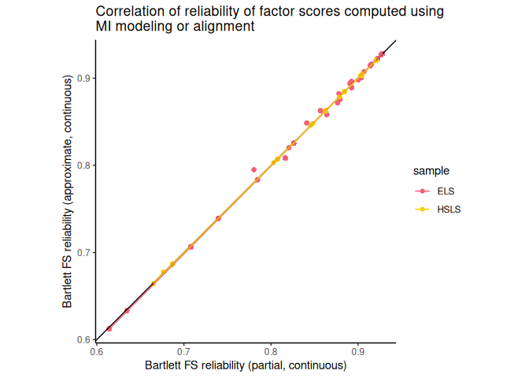

Part3_Results
================
Meltem Ozcan
2024-09-12

This file assumes that the code in `Part1_Harmonization_continuous.Rmd`
and `Part2_Harmonization_ordinal.Rmd` have been run. These two files
result in the rds files that will be read in within the current file. If
those files have not been run yet, please run the files to prepare the
relevant rds files.

# Install and load packages, prepare data.

``` r
library(dplyr)
library(lavaan)
library(sirt)
library(mirt)
library(kableExtra)
library(here)
library(ggplot2)
# also install packages: haven, numDeriv
```

``` r
dat <- readRDS("rds/dat.rds")

est_partial <- readRDS("rds/est_partial.rds")
est_align <- readRDS("rds/est_align.rds")
est_partial_ord <- readRDS("rds/est_partial_ord.rds")
est_align_ord <- readRDS("rds/est_align_ord.rds")
est_align_ord_th <- readRDS("rds/est_align_ord_th.rds")
est_align_ord_lam <- readRDS("rds/est_align_ord_lam.rds")
fit_partial <- readRDS("rds/fit_partial.rds")
fit_align <- readRDS("rds/fit_align.rds")
mod_aligned <- readRDS("rds/mod_aligned.rds")

score_df_cont <- readRDS("rds/score_df_continuous.rds")
score_df_ord <- readRDS("rds/score_df_ord.rds")
df <- cbind(score_df_cont, score_df_ord[,c("approx_ord", "approx_ord_SE", "approx_ord_rel", "approx_ord_ev")])
head(df, 2)
```

    ##      stu_id sample sex dropout i1 i2 i3 i4 i5 mean_score partial_cont
    ## ELS1 101101    ELS   0       0  2  1  2  2  1        1.6    -1.114292
    ## ELS2 101102    ELS   0       0  4  3  4  4  4        3.8     1.658808
    ##      partial_SE approx_cont approx_SE partial_rel approx_rel partial_ev
    ## ELS1   0.278666   -1.131463 0.2781254    0.927941  0.9282002 0.07765475
    ## ELS2   0.278666    1.661305 0.2781254    0.927941  0.9282002 0.07765475
    ##       approx_ev approx_ord approx_ord_SE approx_ord_rel approx_ord_ev
    ## ELS1 0.07735375  -1.018915     0.2476258      0.9386815    0.05755857
    ## ELS2 0.07735375   1.312507     0.2987173      0.9107680    0.08126969

``` r
saveRDS(df, "rds/df.rds")
m_items <- paste0("i", 1:5) 
```

Also source the following R file to repeat the analyses up to this point
on the dataset without any NAs for later sensitivity analyses.

``` r
if (!all(file.exists("rds/score_df_noNAs.rds",
                     "rds/fit_partial_noNAs.rds",
                     "rds/fit_align_noNAs.rds",
                     "rds/est_align_ord_noNAs.rds"))) {
  source("code/repeatAnalysesNoNAs.R")
} else {
  complete_cases <- complete.cases(dat[, m_items]) & dat$sample == "ELS" |
    complete.cases(dat[, m_items[-3]]) & dat$sample == "HSLS"
  d_noNAs <- dat[complete_cases, ]
  fit_partial_noNAs <- readRDS("rds/fit_partial_noNAs.rds")
  fit_align_noNAs <- readRDS("rds/fit_align_noNAs.rds")
  est_align_ord_noNAs <- readRDS("rds/est_align_ord_noNAs.rds")

  score_df_noNAs <- readRDS("rds/score_df_noNAs.rds")
}
```

<table style='width:60%; font-family: "Arial Narrow", "Source Sans Pro", sans-serif; margin-left: auto; margin-right: auto;' class=" lightable-classic">

<caption>

Models by approach and dataset
</caption>

<thead>

<tr>

<th style="empty-cells: hide;" colspan="2">

</th>

<th style="padding-bottom:0; padding-left:3px;padding-right:3px;text-align: center; " colspan="2">

<div style="border-bottom: 1px solid #111111; margin-bottom: -1px; ">

Continuous

</div>

</th>

<th style="padding-bottom:0; padding-left:3px;padding-right:3px;text-align: center; " colspan="2">

<div style="border-bottom: 1px solid #111111; margin-bottom: -1px; ">

Ordinal

</div>

</th>

</tr>

<tr>

<th style="text-align:left;">

</th>

<th style="text-align:center;">

Mean Score
</th>

<th style="text-align:center;">

Partial
</th>

<th style="text-align:center;">

Approximate
</th>

<th style="text-align:center;">

Partial
</th>

<th style="text-align:center;">

Approximate
</th>

</tr>

</thead>

<tbody>

<tr>

<td style="text-align:left;">

N = 30,749
</td>

<td style="text-align:center;">

M_B1
</td>

<td style="text-align:center;">

M1
</td>

<td style="text-align:center;">

M2
</td>

<td style="text-align:center;">

- </td>

  <td style="text-align:center;">

  M3
  </td>

  </tr>

  <tr>

  <td style="text-align:left;">

  N = 29,202
  </td>

  <td style="text-align:center;">

  M_B2
  </td>

  <td style="text-align:center;">

  M4
  </td>

  <td style="text-align:center;">

  M5
  </td>

  <td style="text-align:center;">

  M6
  </td>

  <td style="text-align:center;">

  M7
  </td>

  </tr>

  </tbody>

  </table>

``` r
source('code/table_helper_functions.R')
```

<table style="width:60%; font-family: &quot;Arial Narrow&quot;, &quot;Source Sans Pro&quot;, sans-serif; margin-left: auto; margin-right: auto;" class=" lightable-classic">

<thead>

<tr>

<th style="empty-cells: hide;" colspan="1">

</th>

<th style="padding-bottom:0; padding-left:3px;padding-right:3px;text-align: center; " colspan="4">

<div style="border-bottom: 1px solid #111111; margin-bottom: -1px; ">

Continuous

</div>

</th>

<th style="padding-bottom:0; padding-left:3px;padding-right:3px;text-align: center; " colspan="4">

<div style="border-bottom: 1px solid #111111; margin-bottom: -1px; ">

Ordinal

</div>

</th>

</tr>

<tr>

<th style="empty-cells: hide;" colspan="1">

</th>

<th style="padding-bottom:0; padding-left:3px;padding-right:3px;text-align: center; " colspan="2">

<div style="border-bottom: 1px solid #111111; margin-bottom: -1px; ">

Partial (M1)

</div>

</th>

<th style="padding-bottom:0; padding-left:3px;padding-right:3px;text-align: center; " colspan="2">

<div style="border-bottom: 1px solid #111111; margin-bottom: -1px; ">

Approximate (M2)

</div>

</th>

<th style="padding-bottom:0; padding-left:3px;padding-right:3px;text-align: center; " colspan="2">

<div style="border-bottom: 1px solid #111111; margin-bottom: -1px; ">

Partial (M6)

</div>

</th>

<th style="padding-bottom:0; padding-left:3px;padding-right:3px;text-align: center; " colspan="2">

<div style="border-bottom: 1px solid #111111; margin-bottom: -1px; ">

Approximate (M3)

</div>

</th>

</tr>

<tr>

<th style="empty-cells: hide;" colspan="1">

</th>

<th style="padding-bottom:0; padding-left:3px;padding-right:3px;text-align: center; " colspan="1">

<div style="border-bottom: 1px solid #111111; margin-bottom: -1px; ">

ELS

</div>

</th>

<th style="padding-bottom:0; padding-left:3px;padding-right:3px;text-align: center; " colspan="1">

<div style="border-bottom: 1px solid #111111; margin-bottom: -1px; ">

HSLS

</div>

</th>

<th style="padding-bottom:0; padding-left:3px;padding-right:3px;text-align: center; " colspan="1">

<div style="border-bottom: 1px solid #111111; margin-bottom: -1px; ">

ELS

</div>

</th>

<th style="padding-bottom:0; padding-left:3px;padding-right:3px;text-align: center; " colspan="1">

<div style="border-bottom: 1px solid #111111; margin-bottom: -1px; ">

HSLS

</div>

</th>

<th style="padding-bottom:0; padding-left:3px;padding-right:3px;text-align: center; " colspan="1">

<div style="border-bottom: 1px solid #111111; margin-bottom: -1px; ">

ELS

</div>

</th>

<th style="padding-bottom:0; padding-left:3px;padding-right:3px;text-align: center; " colspan="1">

<div style="border-bottom: 1px solid #111111; margin-bottom: -1px; ">

HSLS

</div>

</th>

<th style="padding-bottom:0; padding-left:3px;padding-right:3px;text-align: center; " colspan="1">

<div style="border-bottom: 1px solid #111111; margin-bottom: -1px; ">

ELS

</div>

</th>

<th style="padding-bottom:0; padding-left:3px;padding-right:3px;text-align: center; " colspan="1">

<div style="border-bottom: 1px solid #111111; margin-bottom: -1px; ">

HSLS

</div>

</th>

</tr>

</thead>

<caption>

Loading estimates by approach and dataset
</caption>

<tbody>

<tr>

<td style="text-align:left;">

i1
</td>

<td style="text-align:center;">

0.74
</td>

<td style="text-align:center;">

0.86
</td>

<td style="text-align:center;">

0.74
</td>

<td style="text-align:center;">

0.75
</td>

<td style="text-align:center;">

1.60
</td>

<td style="text-align:center;">

1.73
</td>

<td style="text-align:center;">

3.37
</td>

<td style="text-align:center;">

3.92
</td>

</tr>

<tr>

<td style="text-align:left;">

i2
</td>

<td style="text-align:center;">

0.73
</td>

<td style="text-align:center;">

0.91
</td>

<td style="text-align:center;">

0.73
</td>

<td style="text-align:center;">

0.80
</td>

<td style="text-align:center;">

1.51
</td>

<td style="text-align:center;">

1.58
</td>

<td style="text-align:center;">

3.48
</td>

<td style="text-align:center;">

3.04
</td>

</tr>

<tr>

<td style="text-align:left;">

i3
</td>

<td style="text-align:center;">

0.83
</td>

<td style="text-align:center;">

NA
</td>

<td style="text-align:center;">

0.83
</td>

<td style="text-align:center;">

NA
</td>

<td style="text-align:center;">

2.05
</td>

<td style="text-align:center;">

NA
</td>

<td style="text-align:center;">

4.37
</td>

<td style="text-align:center;">

NA
</td>

</tr>

<tr>

<td style="text-align:left;">

i4
</td>

<td style="text-align:center;">

0.86
</td>

<td style="text-align:center;">

0.86
</td>

<td style="text-align:center;">

0.85
</td>

<td style="text-align:center;">

0.76
</td>

<td style="text-align:center;">

2.91
</td>

<td style="text-align:center;">

2.91
</td>

<td style="text-align:center;">

4.37
</td>

<td style="text-align:center;">

4.38
</td>

</tr>

<tr>

<td style="text-align:left;">

i5
</td>

<td style="text-align:center;">

0.82
</td>

<td style="text-align:center;">

0.82
</td>

<td style="text-align:center;">

0.84
</td>

<td style="text-align:center;">

0.72
</td>

<td style="text-align:center;">

2.40
</td>

<td style="text-align:center;">

2.40
</td>

<td style="text-align:center;">

4.34
</td>

<td style="text-align:center;">

3.88
</td>

</tr>

</tbody>

</table>

<table style="width:60%; font-family: &quot;Arial Narrow&quot;, &quot;Source Sans Pro&quot;, sans-serif; margin-left: auto; margin-right: auto;" class=" lightable-classic">

<thead>

<tr>

<th style="empty-cells: hide;" colspan="1">

</th>

<th style="padding-bottom:0; padding-left:3px;padding-right:3px;text-align: center; " colspan="4">

<div style="border-bottom: 1px solid #111111; margin-bottom: -1px; ">

Continuous

</div>

</th>

</tr>

<tr>

<th style="empty-cells: hide;" colspan="1">

</th>

<th style="padding-bottom:0; padding-left:3px;padding-right:3px;text-align: center; " colspan="2">

<div style="border-bottom: 1px solid #111111; margin-bottom: -1px; ">

Partial (M1)

</div>

</th>

<th style="padding-bottom:0; padding-left:3px;padding-right:3px;text-align: center; " colspan="2">

<div style="border-bottom: 1px solid #111111; margin-bottom: -1px; ">

Approximate (M2)

</div>

</th>

</tr>

<tr>

<th style="empty-cells: hide;" colspan="1">

</th>

<th style="padding-bottom:0; padding-left:3px;padding-right:3px;text-align: center; " colspan="1">

<div style="border-bottom: 1px solid #111111; margin-bottom: -1px; ">

ELS

</div>

</th>

<th style="padding-bottom:0; padding-left:3px;padding-right:3px;text-align: center; " colspan="1">

<div style="border-bottom: 1px solid #111111; margin-bottom: -1px; ">

HSLS

</div>

</th>

<th style="padding-bottom:0; padding-left:3px;padding-right:3px;text-align: center; " colspan="1">

<div style="border-bottom: 1px solid #111111; margin-bottom: -1px; ">

ELS

</div>

</th>

<th style="padding-bottom:0; padding-left:3px;padding-right:3px;text-align: center; " colspan="1">

<div style="border-bottom: 1px solid #111111; margin-bottom: -1px; ">

HSLS

</div>

</th>

</tr>

</thead>

<caption>

Intercept estimates by approach and dataset
</caption>

<tbody>

<tr>

<td style="text-align:left;">

i1
</td>

<td style="text-align:center;">

2.54
</td>

<td style="text-align:center;">

2.57
</td>

<td style="text-align:center;">

2.54
</td>

<td style="text-align:center;">

2.60
</td>

</tr>

<tr>

<td style="text-align:left;">

i2
</td>

<td style="text-align:center;">

2.36
</td>

<td style="text-align:center;">

2.30
</td>

<td style="text-align:center;">

2.36
</td>

<td style="text-align:center;">

2.32
</td>

</tr>

<tr>

<td style="text-align:left;">

i3
</td>

<td style="text-align:center;">

2.46
</td>

<td style="text-align:center;">

NA
</td>

<td style="text-align:center;">

2.46
</td>

<td style="text-align:center;">

NA
</td>

</tr>

<tr>

<td style="text-align:left;">

i4
</td>

<td style="text-align:center;">

2.65
</td>

<td style="text-align:center;">

2.65
</td>

<td style="text-align:center;">

2.62
</td>

<td style="text-align:center;">

2.69
</td>

</tr>

<tr>

<td style="text-align:left;">

i5
</td>

<td style="text-align:center;">

2.62
</td>

<td style="text-align:center;">

2.62
</td>

<td style="text-align:center;">

2.65
</td>

<td style="text-align:center;">

2.62
</td>

</tr>

</tbody>

</table>

<table style="width:60%; font-family: &quot;Arial Narrow&quot;, &quot;Source Sans Pro&quot;, sans-serif; margin-left: auto; margin-right: auto;" class=" lightable-classic">

<thead>

<tr>

<th style="empty-cells: hide;" colspan="1">

</th>

<th style="padding-bottom:0; padding-left:3px;padding-right:3px;text-align: center; " colspan="4">

<div style="border-bottom: 1px solid #111111; margin-bottom: -1px; ">

Ordinal

</div>

</th>

</tr>

<tr>

<th style="empty-cells: hide;" colspan="1">

</th>

<th style="padding-bottom:0; padding-left:3px;padding-right:3px;text-align: center; " colspan="2">

<div style="border-bottom: 1px solid #111111; margin-bottom: -1px; ">

Partial (M6)

</div>

</th>

<th style="padding-bottom:0; padding-left:3px;padding-right:3px;text-align: center; " colspan="2">

<div style="border-bottom: 1px solid #111111; margin-bottom: -1px; ">

Approximate (M3)

</div>

</th>

</tr>

<tr>

<th style="empty-cells: hide;" colspan="1">

</th>

<th style="padding-bottom:0; padding-left:3px;padding-right:3px;text-align: center; " colspan="1">

<div style="border-bottom: 1px solid #111111; margin-bottom: -1px; ">

ELS

</div>

</th>

<th style="padding-bottom:0; padding-left:3px;padding-right:3px;text-align: center; " colspan="1">

<div style="border-bottom: 1px solid #111111; margin-bottom: -1px; ">

HSLS

</div>

</th>

<th style="padding-bottom:0; padding-left:3px;padding-right:3px;text-align: center; " colspan="1">

<div style="border-bottom: 1px solid #111111; margin-bottom: -1px; ">

ELS

</div>

</th>

<th style="padding-bottom:0; padding-left:3px;padding-right:3px;text-align: center; " colspan="1">

<div style="border-bottom: 1px solid #111111; margin-bottom: -1px; ">

HSLS

</div>

</th>

</tr>

</thead>

<caption>

Threshold estimates by approach and dataset
</caption>

<tbody>

<tr>

<td style="text-align:left;">

i1\|t1
</td>

<td style="text-align:center;">

-2.41
</td>

<td style="text-align:center;">

-2.41
</td>

<td style="text-align:center;">

4.72
</td>

<td style="text-align:center;">

4.75
</td>

</tr>

<tr>

<td style="text-align:left;">

i1\|t2
</td>

<td style="text-align:center;">

0.26
</td>

<td style="text-align:center;">

-0.71
</td>

<td style="text-align:center;">

3.49
</td>

<td style="text-align:center;">

2.85
</td>

</tr>

<tr>

<td style="text-align:left;border-bottom: 1px solid">

i1\|t3
</td>

<td style="text-align:center;border-bottom: 1px solid">

1.58
</td>

<td style="text-align:center;border-bottom: 1px solid">

1.58
</td>

<td style="text-align:center;border-bottom: 1px solid">

4.50
</td>

<td style="text-align:center;border-bottom: 1px solid">

NA
</td>

</tr>

<tr>

<td style="text-align:left;">

i2\|t1
</td>

<td style="text-align:center;">

-1.74
</td>

<td style="text-align:center;">

-1.74
</td>

<td style="text-align:center;">

5.64
</td>

<td style="text-align:center;">

5.63
</td>

</tr>

<tr>

<td style="text-align:left;">

i2\|t2
</td>

<td style="text-align:center;">

0.45
</td>

<td style="text-align:center;">

-0.05
</td>

<td style="text-align:center;">

5.74
</td>

<td style="text-align:center;">

4.94
</td>

</tr>

<tr>

<td style="text-align:left;border-bottom: 1px solid">

i2\|t3
</td>

<td style="text-align:center;border-bottom: 1px solid">

1.90
</td>

<td style="text-align:center;border-bottom: 1px solid">

1.90
</td>

<td style="text-align:center;border-bottom: 1px solid">

-0.44
</td>

<td style="text-align:center;border-bottom: 1px solid">

0.35
</td>

</tr>

<tr>

<td style="text-align:left;">

i3\|t1
</td>

<td style="text-align:center;">

-2.33
</td>

<td style="text-align:center;">

NA
</td>

<td style="text-align:center;">

-0.88
</td>

<td style="text-align:center;">

-0.93
</td>

</tr>

<tr>

<td style="text-align:left;">

i3\|t2
</td>

<td style="text-align:center;">

0.28
</td>

<td style="text-align:center;">

NA
</td>

<td style="text-align:center;">

-0.48
</td>

<td style="text-align:center;">

NA
</td>

</tr>

<tr>

<td style="text-align:left;border-bottom: 1px solid">

i3\|t3
</td>

<td style="text-align:center;border-bottom: 1px solid">

2.06
</td>

<td style="text-align:center;border-bottom: 1px solid">

NA
</td>

<td style="text-align:center;border-bottom: 1px solid">

0.29
</td>

<td style="text-align:center;border-bottom: 1px solid">

1.24
</td>

</tr>

<tr>

<td style="text-align:left;">

i4\|t1
</td>

<td style="text-align:center;">

-4.01
</td>

<td style="text-align:center;">

-4.01
</td>

<td style="text-align:center;">

0.44
</td>

<td style="text-align:center;">

0.56
</td>

</tr>

<tr>

<td style="text-align:left;">

i4\|t2
</td>

<td style="text-align:center;">

-0.16
</td>

<td style="text-align:center;">

-1.68
</td>

<td style="text-align:center;">

-3.07
</td>

<td style="text-align:center;">

-5.61
</td>

</tr>

<tr>

<td style="text-align:left;border-bottom: 1px solid">

i4\|t3
</td>

<td style="text-align:center;border-bottom: 1px solid">

2.39
</td>

<td style="text-align:center;border-bottom: 1px solid">

2.39
</td>

<td style="text-align:center;border-bottom: 1px solid">

-4.18
</td>

<td style="text-align:center;border-bottom: 1px solid">

-5.50
</td>

</tr>

<tr>

<td style="text-align:left;">

i5\|t1
</td>

<td style="text-align:center;">

-3.39
</td>

<td style="text-align:center;">

-3.39
</td>

<td style="text-align:center;">

-4.26
</td>

<td style="text-align:center;">

NA
</td>

</tr>

<tr>

<td style="text-align:left;">

i5\|t2
</td>

<td style="text-align:center;">

-0.23
</td>

<td style="text-align:center;">

-1.10
</td>

<td style="text-align:center;">

-3.56
</td>

<td style="text-align:center;">

-5.78
</td>

</tr>

<tr>

<td style="text-align:left;">

i5\|t3
</td>

<td style="text-align:center;">

1.92
</td>

<td style="text-align:center;">

2.32
</td>

<td style="text-align:center;">

-3.41
</td>

<td style="text-align:center;">

-5.78
</td>

</tr>

</tbody>

</table>

<table style="width:60%; font-family: &quot;Arial Narrow&quot;, &quot;Source Sans Pro&quot;, sans-serif; margin-left: auto; margin-right: auto;" class=" lightable-classic">

<thead>

<tr>

<th style="empty-cells: hide;" colspan="1">

</th>

<th style="padding-bottom:0; padding-left:3px;padding-right:3px;text-align: center; " colspan="4">

<div style="border-bottom: 1px solid #111111; margin-bottom: -1px; ">

Continuous

</div>

</th>

<th style="padding-bottom:0; padding-left:3px;padding-right:3px;text-align: center; " colspan="4">

<div style="border-bottom: 1px solid #111111; margin-bottom: -1px; ">

Ordinal

</div>

</th>

</tr>

<tr>

<th style="empty-cells: hide;" colspan="1">

</th>

<th style="padding-bottom:0; padding-left:3px;padding-right:3px;text-align: center; " colspan="2">

<div style="border-bottom: 1px solid #111111; margin-bottom: -1px; ">

Partial (M1)

</div>

</th>

<th style="padding-bottom:0; padding-left:3px;padding-right:3px;text-align: center; " colspan="2">

<div style="border-bottom: 1px solid #111111; margin-bottom: -1px; ">

Approximate (M2)

</div>

</th>

<th style="padding-bottom:0; padding-left:3px;padding-right:3px;text-align: center; " colspan="2">

<div style="border-bottom: 1px solid #111111; margin-bottom: -1px; ">

Partial (M6)

</div>

</th>

<th style="padding-bottom:0; padding-left:3px;padding-right:3px;text-align: center; " colspan="2">

<div style="border-bottom: 1px solid #111111; margin-bottom: -1px; ">

Approximate (M3)

</div>

</th>

</tr>

<tr>

<th style="empty-cells: hide;" colspan="1">

</th>

<th style="padding-bottom:0; padding-left:3px;padding-right:3px;text-align: center; " colspan="1">

<div style="border-bottom: 1px solid #111111; margin-bottom: -1px; ">

ELS

</div>

</th>

<th style="padding-bottom:0; padding-left:3px;padding-right:3px;text-align: center; " colspan="1">

<div style="border-bottom: 1px solid #111111; margin-bottom: -1px; ">

HSLS

</div>

</th>

<th style="padding-bottom:0; padding-left:3px;padding-right:3px;text-align: center; " colspan="1">

<div style="border-bottom: 1px solid #111111; margin-bottom: -1px; ">

ELS

</div>

</th>

<th style="padding-bottom:0; padding-left:3px;padding-right:3px;text-align: center; " colspan="1">

<div style="border-bottom: 1px solid #111111; margin-bottom: -1px; ">

HSLS

</div>

</th>

<th style="padding-bottom:0; padding-left:3px;padding-right:3px;text-align: center; " colspan="1">

<div style="border-bottom: 1px solid #111111; margin-bottom: -1px; ">

ELS

</div>

</th>

<th style="padding-bottom:0; padding-left:3px;padding-right:3px;text-align: center; " colspan="1">

<div style="border-bottom: 1px solid #111111; margin-bottom: -1px; ">

HSLS

</div>

</th>

<th style="padding-bottom:0; padding-left:3px;padding-right:3px;text-align: center; " colspan="1">

<div style="border-bottom: 1px solid #111111; margin-bottom: -1px; ">

ELS

</div>

</th>

<th style="padding-bottom:0; padding-left:3px;padding-right:3px;text-align: center; " colspan="1">

<div style="border-bottom: 1px solid #111111; margin-bottom: -1px; ">

HSLS

</div>

</th>

</tr>

</thead>

<caption>

Latent mean and variance estimates by approach and dataset
</caption>

<tbody>

<tr>

<td style="text-align:left;">

Latent mean
</td>

<td style="text-align:center;">

0
</td>

<td style="text-align:center;">

0.47
</td>

<td style="text-align:center;">

0
</td>

<td style="text-align:center;">

0.50
</td>

<td style="text-align:center;">

0
</td>

<td style="text-align:center;">

0.28
</td>

<td style="text-align:center;">

0
</td>

<td style="text-align:center;">

0.70
</td>

</tr>

<tr>

<td style="text-align:left;">

Latent variance
</td>

<td style="text-align:center;">

1
</td>

<td style="text-align:center;">

0.53
</td>

<td style="text-align:center;">

1
</td>

<td style="text-align:center;">

0.69
</td>

<td style="text-align:center;">

1
</td>

<td style="text-align:center;">

0.66
</td>

<td style="text-align:center;">

1
</td>

<td style="text-align:center;">

0.94
</td>

</tr>

</tbody>

</table>

## Score distributions

<table class=" lightable-classic" style='font-family: "Arial Narrow", "Source Sans Pro", sans-serif; margin-left: auto; margin-right: auto;'>

<caption>

Mean and SD of scores by approach and dataset
</caption>

<thead>

<tr>

<th style="empty-cells: hide;" colspan="3">

</th>

<th style="padding-bottom:0; padding-left:3px;padding-right:3px;text-align: center; " colspan="4">

<div style="border-bottom: 1px solid #111111; margin-bottom: -1px; ">

Continuous

</div>

</th>

<th style="padding-bottom:0; padding-left:3px;padding-right:3px;text-align: center; " colspan="4">

<div style="border-bottom: 1px solid #111111; margin-bottom: -1px; ">

Ordinal

</div>

</th>

</tr>

<tr>

<th style="empty-cells: hide;" colspan="1">

</th>

<th style="padding-bottom:0; padding-left:3px;padding-right:3px;text-align: center; " colspan="2">

<div style="border-bottom: 1px solid #111111; margin-bottom: -1px; ">

Mean Score

</div>

</th>

<th style="padding-bottom:0; padding-left:3px;padding-right:3px;text-align: center; " colspan="2">

<div style="border-bottom: 1px solid #111111; margin-bottom: -1px; ">

Partial

</div>

</th>

<th style="padding-bottom:0; padding-left:3px;padding-right:3px;text-align: center; " colspan="2">

<div style="border-bottom: 1px solid #111111; margin-bottom: -1px; ">

Approximate

</div>

</th>

<th style="padding-bottom:0; padding-left:3px;padding-right:3px;text-align: center; " colspan="2">

<div style="border-bottom: 1px solid #111111; margin-bottom: -1px; ">

Partial

</div>

</th>

<th style="padding-bottom:0; padding-left:3px;padding-right:3px;text-align: center; " colspan="2">

<div style="border-bottom: 1px solid #111111; margin-bottom: -1px; ">

Approximate

</div>

</th>

</tr>

<tr>

<th style="text-align:left;">

</th>

<th style="text-align:center;">

M
</th>

<th style="text-align:center;">

SD
</th>

<th style="text-align:center;">

M
</th>

<th style="text-align:center;">

SD
</th>

<th style="text-align:center;">

M
</th>

<th style="text-align:center;">

SD
</th>

<th style="text-align:center;">

M
</th>

<th style="text-align:center;">

SD
</th>

<th style="text-align:center;">

M
</th>

<th style="text-align:center;">

SD
</th>

</tr>

</thead>

<tbody>

<tr>

<td style="text-align:left;font-weight: bold;border-bottom: 1px solid">

N = 30,740
</td>

<td style="text-align:center;font-weight: bold;border-bottom: 1px solid">

M_B1
</td>

<td style="text-align:center;font-weight: bold;border-bottom: 1px solid">

</td>

<td style="text-align:center;font-weight: bold;border-bottom: 1px solid">

M1
</td>

<td style="text-align:center;font-weight: bold;border-bottom: 1px solid">

</td>

<td style="text-align:center;font-weight: bold;border-bottom: 1px solid">

M2
</td>

<td style="text-align:center;font-weight: bold;border-bottom: 1px solid">

</td>

<td style="text-align:center;font-weight: bold;border-bottom: 1px solid">

</td>

<td style="text-align:center;font-weight: bold;border-bottom: 1px solid">

</td>

<td style="text-align:center;font-weight: bold;border-bottom: 1px solid">

M3
</td>

<td style="text-align:center;font-weight: bold;border-bottom: 1px solid">

</td>

</tr>

<tr>

<td style="text-align:left;">

ELS
</td>

<td style="text-align:center;">

2.52
</td>

<td style="text-align:center;">

0.845
</td>

<td style="text-align:center;">

-0.003
</td>

<td style="text-align:center;">

1.051
</td>

<td style="text-align:center;">

-0.004
</td>

<td style="text-align:center;">

1.051
</td>

<td style="text-align:center;">

- </td>

  <td style="text-align:center;">

  - </td>

    <td style="text-align:center;">

    -0.001
    </td>

    <td style="text-align:center;">

    0.952
    </td>

    </tr>

    <tr>

    <td style="text-align:left;">

    HSLS
    </td>

    <td style="text-align:center;">

    2.938
    </td>

    <td style="text-align:center;">

    0.661
    </td>

    <td style="text-align:center;">

    0.469
    </td>

    <td style="text-align:center;">

    0.763
    </td>

    <td style="text-align:center;">

    0.501
    </td>

    <td style="text-align:center;">

    0.869
    </td>

    <td style="text-align:center;">

    - </td>

      <td style="text-align:center;">

      - </td>

        <td style="text-align:center;">

        0.619
        </td>

        <td style="text-align:center;">

        0.908
        </td>

        </tr>

        <tr>

        <td style="text-align:left;border-bottom: 1px solid">

        overall
        </td>

        <td style="text-align:center;border-bottom: 1px solid">

        2.779
        </td>

        <td style="text-align:center;border-bottom: 1px solid">

        0.764
        </td>

        <td style="text-align:center;border-bottom: 1px solid">

        0.29
        </td>

        <td style="text-align:center;border-bottom: 1px solid">

        0.912
        </td>

        <td style="text-align:center;border-bottom: 1px solid">

        0.31
        </td>

        <td style="text-align:center;border-bottom: 1px solid">

        0.973
        </td>

        <td style="text-align:center;border-bottom: 1px solid">

        - </td>

          <td style="text-align:center;border-bottom: 1px solid">

          - </td>

            <td style="text-align:center;border-bottom: 1px solid">

            0.384
            </td>

            <td style="text-align:center;border-bottom: 1px solid">

            0.973
            </td>

            </tr>

            <tr>

            <td style="text-align:left;font-weight: bold;border-bottom: 1px solid">

            N = 29,202
            </td>

            <td style="text-align:center;font-weight: bold;border-bottom: 1px solid">

            M_B1
            </td>

            <td style="text-align:center;font-weight: bold;border-bottom: 1px solid">

            </td>

            <td style="text-align:center;font-weight: bold;border-bottom: 1px solid">

            M4
            </td>

            <td style="text-align:center;font-weight: bold;border-bottom: 1px solid">

            </td>

            <td style="text-align:center;font-weight: bold;border-bottom: 1px solid">

            M5
            </td>

            <td style="text-align:center;font-weight: bold;border-bottom: 1px solid">

            </td>

            <td style="text-align:center;font-weight: bold;border-bottom: 1px solid">

            M6
            </td>

            <td style="text-align:center;font-weight: bold;border-bottom: 1px solid">

            </td>

            <td style="text-align:center;font-weight: bold;border-bottom: 1px solid">

            M7
            </td>

            <td style="text-align:center;font-weight: bold;border-bottom: 1px solid">

            </td>

            </tr>

            <tr>

            <td style="text-align:left;">

            ELS
            </td>

            <td style="text-align:center;">

            2.545
            </td>

            <td style="text-align:center;">

            0.833
            </td>

            <td style="text-align:center;">

            0
            </td>

            <td style="text-align:center;">

            1.038
            </td>

            <td style="text-align:center;">

            0
            </td>

            <td style="text-align:center;">

            1.038
            </td>

            <td style="text-align:center;">

            0.001
            </td>

            <td style="text-align:center;">

            0.939
            </td>

            <td style="text-align:center;">

            -0.001
            </td>

            <td style="text-align:center;">

            0.957
            </td>

            </tr>

            <tr>

            <td style="text-align:left;">

            HSLS
            </td>

            <td style="text-align:center;">

            2.938
            </td>

            <td style="text-align:center;">

            0.661
            </td>

            <td style="text-align:center;">

            0.45
            </td>

            <td style="text-align:center;">

            0.767
            </td>

            <td style="text-align:center;">

            0.477
            </td>

            <td style="text-align:center;">

            0.869
            </td>

            <td style="text-align:center;">

            0.022
            </td>

            <td style="text-align:center;">

            0.784
            </td>

            <td style="text-align:center;">

            0.574
            </td>

            <td style="text-align:center;">

            0.904
            </td>

            </tr>

            <tr>

            <td style="text-align:left;">

            overall
            </td>

            <td style="text-align:center;">

            2.797
            </td>

            <td style="text-align:center;">

            0.751
            </td>

            <td style="text-align:center;">

            0.289
            </td>

            <td style="text-align:center;">

            0.9
            </td>

            <td style="text-align:center;">

            0.306
            </td>

            <td style="text-align:center;">

            0.96
            </td>

            <td style="text-align:center;">

            0.015
            </td>

            <td style="text-align:center;">

            0.843
            </td>

            <td style="text-align:center;">

            0.368
            </td>

            <td style="text-align:center;">

            0.964
            </td>

            </tr>

            </tbody>

            </table>

## Score correlations

``` r
# compute matrix of correlations
cor_30749 <- cor(df[, c("mean_score", "partial_cont", "approx_cont", "approx_ord")], use = "complete.obs")
```

<table style="width:80%;">

<caption>

Correlation of FS (N = 30,740)
</caption>

<thead>

<tr>

<th style="empty-cells: hide;border-bottom:hidden;" colspan="1">

</th>

<th style="empty-cells: hide;border-bottom:hidden;" colspan="1">

</th>

<th style="border-bottom:hidden;padding-bottom:0; padding-left:3px;padding-right:3px;text-align: center; " colspan="2">

<div style="border-bottom: 1px solid #ddd; padding-bottom: 5px; ">

Continuous

</div>

</th>

<th style="border-bottom:hidden;padding-bottom:0; padding-left:3px;padding-right:3px;text-align: center; " colspan="2">

<div style="border-bottom: 1px solid #ddd; padding-bottom: 5px; ">

Ordinal

</div>

</th>

</tr>

<tr>

<th style="empty-cells: hide;border-bottom:hidden;" colspan="1">

</th>

<th style="border-bottom:hidden;padding-bottom:0; padding-left:3px;padding-right:3px;text-align: center; " colspan="1">

<div style="border-bottom: 1px solid #ddd; padding-bottom: 5px; ">

Mean scores

</div>

</th>

<th style="border-bottom:hidden;padding-bottom:0; padding-left:3px;padding-right:3px;text-align: center; " colspan="1">

<div style="border-bottom: 1px solid #ddd; padding-bottom: 5px; ">

Partial

</div>

</th>

<th style="border-bottom:hidden;padding-bottom:0; padding-left:3px;padding-right:3px;text-align: center; " colspan="1">

<div style="border-bottom: 1px solid #ddd; padding-bottom: 5px; ">

Approximate

</div>

</th>

<th style="border-bottom:hidden;padding-bottom:0; padding-left:3px;padding-right:3px;text-align: center; " colspan="1">

<div style="border-bottom: 1px solid #ddd; padding-bottom: 5px; ">

Partial

</div>

</th>

<th style="border-bottom:hidden;padding-bottom:0; padding-left:3px;padding-right:3px;text-align: center; " colspan="1">

<div style="border-bottom: 1px solid #ddd; padding-bottom: 5px; ">

Approximate

</div>

</th>

</tr>

<tr>

<th style="text-align:left;font-weight: bold;">

</th>

<th style="text-align:center;font-weight: bold;">

M_B1
</th>

<th style="text-align:center;font-weight: bold;">

M1
</th>

<th style="text-align:center;font-weight: bold;">

M2
</th>

<th style="text-align:center;font-weight: bold;">

- </th>

  <th style="text-align:center;font-weight: bold;">

  M3
  </th>

  </tr>

  </thead>

  <tbody>

  <tr>

  <td style="text-align:left;font-weight: bold;">

  M_B1
  </td>

  <td style="text-align:center;">

  1
  </td>

  <td style="text-align:center;">

  0.992
  </td>

  <td style="text-align:center;">

  0.993
  </td>

  <td style="text-align:center;">

  - </td>

    <td style="text-align:center;">

    0.989
    </td>

    </tr>

    <tr>

    <td style="text-align:left;font-weight: bold;">

    M1
    </td>

    <td style="text-align:center;">

    0.992
    </td>

    <td style="text-align:center;">

    1
    </td>

    <td style="text-align:center;">

    0.998
    </td>

    <td style="text-align:center;">

    - </td>

      <td style="text-align:center;">

      0.98
      </td>

      </tr>

      <tr>

      <td style="text-align:left;font-weight: bold;">

      M2
      </td>

      <td style="text-align:center;">

      0.993
      </td>

      <td style="text-align:center;">

      0.998
      </td>

      <td style="text-align:center;">

      1
      </td>

      <td style="text-align:center;">

      - </td>

        <td style="text-align:center;">

        0.986
        </td>

        </tr>

        <tr>

        <td style="text-align:left;font-weight: bold;">

        - </td>

          <td style="text-align:center;">

          - </td>

            <td style="text-align:center;">

            - </td>

              <td style="text-align:center;">

              - </td>

                <td style="text-align:center;">

                - </td>

                  <td style="text-align:center;">

                  - </td>

                    </tr>

                    <tr>

                    <td style="text-align:left;font-weight: bold;">

                    M3
                    </td>

                    <td style="text-align:center;">

                    0.989
                    </td>

                    <td style="text-align:center;">

                    0.98
                    </td>

                    <td style="text-align:center;">

                    0.986
                    </td>

                    <td style="text-align:center;">

                    - </td>

                      <td style="text-align:center;">

                      1
                      </td>

                      </tr>

                      </tbody>

                      </table>

<table style="width:80%;">

<caption>

Correlation of FS on dataset with no NAs (N = 29,202)
</caption>

<thead>

<tr>

<th style="empty-cells: hide;border-bottom:hidden;" colspan="1">

</th>

<th style="empty-cells: hide;border-bottom:hidden;" colspan="1">

</th>

<th style="border-bottom:hidden;padding-bottom:0; padding-left:3px;padding-right:3px;text-align: center; " colspan="2">

<div style="border-bottom: 1px solid #ddd; padding-bottom: 5px; ">

Continuous

</div>

</th>

<th style="border-bottom:hidden;padding-bottom:0; padding-left:3px;padding-right:3px;text-align: center; " colspan="2">

<div style="border-bottom: 1px solid #ddd; padding-bottom: 5px; ">

Ordinal

</div>

</th>

</tr>

<tr>

<th style="empty-cells: hide;border-bottom:hidden;" colspan="1">

</th>

<th style="border-bottom:hidden;padding-bottom:0; padding-left:3px;padding-right:3px;text-align: center; " colspan="1">

<div style="border-bottom: 1px solid #ddd; padding-bottom: 5px; ">

Mean scores

</div>

</th>

<th style="border-bottom:hidden;padding-bottom:0; padding-left:3px;padding-right:3px;text-align: center; " colspan="1">

<div style="border-bottom: 1px solid #ddd; padding-bottom: 5px; ">

Partial

</div>

</th>

<th style="border-bottom:hidden;padding-bottom:0; padding-left:3px;padding-right:3px;text-align: center; " colspan="1">

<div style="border-bottom: 1px solid #ddd; padding-bottom: 5px; ">

Approximate

</div>

</th>

<th style="border-bottom:hidden;padding-bottom:0; padding-left:3px;padding-right:3px;text-align: center; " colspan="1">

<div style="border-bottom: 1px solid #ddd; padding-bottom: 5px; ">

Partial

</div>

</th>

<th style="border-bottom:hidden;padding-bottom:0; padding-left:3px;padding-right:3px;text-align: center; " colspan="1">

<div style="border-bottom: 1px solid #ddd; padding-bottom: 5px; ">

Approximate

</div>

</th>

</tr>

<tr>

<th style="text-align:left;font-weight: bold;">

</th>

<th style="text-align:center;font-weight: bold;">

M_B2
</th>

<th style="text-align:center;font-weight: bold;">

M4
</th>

<th style="text-align:center;font-weight: bold;">

M5
</th>

<th style="text-align:center;font-weight: bold;">

M6
</th>

<th style="text-align:center;font-weight: bold;">

M7
</th>

</tr>

</thead>

<tbody>

<tr>

<td style="text-align:left;font-weight: bold;">

M_B2
</td>

<td style="text-align:center;">

1
</td>

<td style="text-align:center;">

0.992
</td>

<td style="text-align:center;">

0.993
</td>

<td style="text-align:center;">

0.965
</td>

<td style="text-align:center;">

0.991
</td>

</tr>

<tr>

<td style="text-align:left;font-weight: bold;">

M4
</td>

<td style="text-align:center;">

0.992
</td>

<td style="text-align:center;">

1
</td>

<td style="text-align:center;">

0.998
</td>

<td style="text-align:center;">

0.964
</td>

<td style="text-align:center;">

0.983
</td>

</tr>

<tr>

<td style="text-align:left;font-weight: bold;">

M5
</td>

<td style="text-align:center;">

0.993
</td>

<td style="text-align:center;">

0.998
</td>

<td style="text-align:center;">

1
</td>

<td style="text-align:center;">

0.966
</td>

<td style="text-align:center;">

0.988
</td>

</tr>

<tr>

<td style="text-align:left;font-weight: bold;">

M6
</td>

<td style="text-align:center;">

0.965
</td>

<td style="text-align:center;">

0.964
</td>

<td style="text-align:center;">

0.966
</td>

<td style="text-align:center;">

1
</td>

<td style="text-align:center;">

0.957
</td>

</tr>

<tr>

<td style="text-align:left;font-weight: bold;">

M7
</td>

<td style="text-align:center;">

0.991
</td>

<td style="text-align:center;">

0.983
</td>

<td style="text-align:center;">

0.988
</td>

<td style="text-align:center;">

0.957
</td>

<td style="text-align:center;">

1
</td>

</tr>

</tbody>

</table>

<!-- --><!-- --><!-- --><!-- --><!-- --><!-- --><!-- --><!-- --><!-- -->

## Reliability

``` r
mnsd(df$partial_rel)
```

    ## [1] 0.91736732 0.03280564

``` r
mnsd(df$approx_rel)
```

    ## [1] 0.91732712 0.03304773

``` r
mnsd(df$approx_ord_rel)
```

    ## [1] 0.89223975 0.05391562

<table style="width:70%;">

<thead>

<tr>

<th style="empty-cells: hide;border-bottom:hidden;" colspan="1">

</th>

<th style="border-bottom:hidden;padding-bottom:0; padding-left:3px;padding-right:3px;text-align: center; " colspan="4">

<div style="border-bottom: 1px solid #ddd; padding-bottom: 5px; ">

Continuous

</div>

</th>

<th style="border-bottom:hidden;padding-bottom:0; padding-left:3px;padding-right:3px;text-align: center; " colspan="4">

<div style="border-bottom: 1px solid #ddd; padding-bottom: 5px; ">

Ordinal

</div>

</th>

</tr>

<tr>

<th style="empty-cells: hide;border-bottom:hidden;" colspan="1">

</th>

<th style="border-bottom:hidden;padding-bottom:0; padding-left:3px;padding-right:3px;text-align: center; " colspan="2">

<div style="border-bottom: 1px solid #ddd; padding-bottom: 5px; ">

Partial

</div>

</th>

<th style="border-bottom:hidden;padding-bottom:0; padding-left:3px;padding-right:3px;text-align: center; " colspan="2">

<div style="border-bottom: 1px solid #ddd; padding-bottom: 5px; ">

Approximate

</div>

</th>

<th style="border-bottom:hidden;padding-bottom:0; padding-left:3px;padding-right:3px;text-align: center; " colspan="2">

<div style="border-bottom: 1px solid #ddd; padding-bottom: 5px; ">

Partial

</div>

</th>

<th style="border-bottom:hidden;padding-bottom:0; padding-left:3px;padding-right:3px;text-align: center; " colspan="2">

<div style="border-bottom: 1px solid #ddd; padding-bottom: 5px; ">

Approximate

</div>

</th>

</tr>

<tr>

<th style="empty-cells: hide;border-bottom:hidden;" colspan="1">

</th>

<th style="border-bottom:hidden;padding-bottom:0; padding-left:3px;padding-right:3px;text-align: center; " colspan="1">

<div style="border-bottom: 1px solid #ddd; padding-bottom: 5px; ">

ELS

</div>

</th>

<th style="border-bottom:hidden;padding-bottom:0; padding-left:3px;padding-right:3px;text-align: center; " colspan="1">

<div style="border-bottom: 1px solid #ddd; padding-bottom: 5px; ">

HSLS

</div>

</th>

<th style="border-bottom:hidden;padding-bottom:0; padding-left:3px;padding-right:3px;text-align: center; " colspan="1">

<div style="border-bottom: 1px solid #ddd; padding-bottom: 5px; ">

ELS

</div>

</th>

<th style="border-bottom:hidden;padding-bottom:0; padding-left:3px;padding-right:3px;text-align: center; " colspan="1">

<div style="border-bottom: 1px solid #ddd; padding-bottom: 5px; ">

HSLS

</div>

</th>

<th style="border-bottom:hidden;padding-bottom:0; padding-left:3px;padding-right:3px;text-align: center; " colspan="1">

<div style="border-bottom: 1px solid #ddd; padding-bottom: 5px; ">

ELS

</div>

</th>

<th style="border-bottom:hidden;padding-bottom:0; padding-left:3px;padding-right:3px;text-align: center; " colspan="1">

<div style="border-bottom: 1px solid #ddd; padding-bottom: 5px; ">

HSLS

</div>

</th>

<th style="border-bottom:hidden;padding-bottom:0; padding-left:3px;padding-right:3px;text-align: center; " colspan="1">

<div style="border-bottom: 1px solid #ddd; padding-bottom: 5px; ">

ELS

</div>

</th>

<th style="border-bottom:hidden;padding-bottom:0; padding-left:3px;padding-right:3px;text-align: center; " colspan="1">

<div style="border-bottom: 1px solid #ddd; padding-bottom: 5px; ">

HSLS

</div>

</th>

</tr>

</thead>

<caption>

Mean and SD of FS Reliabilities (N = 30,740)
</caption>

<tbody>

<tr>

<td style="text-align:left;">

Mean
</td>

<td style="text-align:center;">

0.9139
</td>

<td style="text-align:center;">

0.9195
</td>

<td style="text-align:center;">

0.914
</td>

<td style="text-align:center;">

0.9193
</td>

<td style="text-align:center;">

- </td>

  <td style="text-align:center;">

  - </td>

    <td style="text-align:center;">

    0.9068
    </td>

    <td style="text-align:center;">

    0.8833
    </td>

    </tr>

    <tr>

    <td style="text-align:left;">

    SD
    </td>

    <td style="text-align:center;">

    0.0515
    </td>

    <td style="text-align:center;">

    0.0102
    </td>

    <td style="text-align:center;">

    0.0519
    </td>

    <td style="text-align:center;">

    0.0102
    </td>

    <td style="text-align:center;">

    - </td>

      <td style="text-align:center;">

      - </td>

        <td style="text-align:center;">

        0.0668
        </td>

        <td style="text-align:center;">

        0.0418
        </td>

        </tr>

        </tbody>

        </table>

<!-- --><!-- --><!-- -->

``` r
rel_30749 <- cor(as.matrix(apply(df[ ,c("partial_rel",
                                               "approx_rel", 
                                               "approx_ord_rel")], 
                                 as.numeric, MARGIN = 2)),
                 use = "complete.obs")
rel_30749 <- round(rel_30749, 4)
rel_30749_add_row <- rbind(rel_30749[1:2,], rep("-",3) , rel_30749[3,])
rel_30749_add_col <- cbind(rel_30749_add_row[,1:2], rep("-",4) , rel_30749_add_row[,3])
colnames(rel_30749_add_col) <- rownames(rel_30749_add_col) <- as.character(models[1,])[2:5]
```

<table style="width:80%;">

<caption>

Correlation of FS Reliabilities (N = 30,740)
</caption>

<thead>

<tr>

<th style="empty-cells: hide;border-bottom:hidden;" colspan="1">

</th>

<th style="border-bottom:hidden;padding-bottom:0; padding-left:3px;padding-right:3px;text-align: center; " colspan="2">

<div style="border-bottom: 1px solid #ddd; padding-bottom: 5px; ">

Continuous

</div>

</th>

<th style="border-bottom:hidden;padding-bottom:0; padding-left:3px;padding-right:3px;text-align: center; " colspan="2">

<div style="border-bottom: 1px solid #ddd; padding-bottom: 5px; ">

Ordinal

</div>

</th>

</tr>

<tr>

<th style="empty-cells: hide;border-bottom:hidden;" colspan="1">

</th>

<th style="border-bottom:hidden;padding-bottom:0; padding-left:3px;padding-right:3px;text-align: center; " colspan="1">

<div style="border-bottom: 1px solid #ddd; padding-bottom: 5px; ">

Partial

</div>

</th>

<th style="border-bottom:hidden;padding-bottom:0; padding-left:3px;padding-right:3px;text-align: center; " colspan="1">

<div style="border-bottom: 1px solid #ddd; padding-bottom: 5px; ">

Approximate

</div>

</th>

<th style="border-bottom:hidden;padding-bottom:0; padding-left:3px;padding-right:3px;text-align: center; " colspan="1">

<div style="border-bottom: 1px solid #ddd; padding-bottom: 5px; ">

Partial

</div>

</th>

<th style="border-bottom:hidden;padding-bottom:0; padding-left:3px;padding-right:3px;text-align: center; " colspan="1">

<div style="border-bottom: 1px solid #ddd; padding-bottom: 5px; ">

Approximate

</div>

</th>

</tr>

<tr>

<th style="text-align:left;font-weight: bold;">

</th>

<th style="text-align:center;font-weight: bold;">

M1
</th>

<th style="text-align:center;font-weight: bold;">

M2
</th>

<th style="text-align:center;font-weight: bold;">

- </th>

  <th style="text-align:center;font-weight: bold;">

  M3
  </th>

  </tr>

  </thead>

  <tbody>

  <tr>

  <td style="text-align:left;font-weight: bold;">

  M1
  </td>

  <td style="text-align:center;">

  1
  </td>

  <td style="text-align:center;">

  0.9999
  </td>

  <td style="text-align:center;">

  - </td>

    <td style="text-align:center;">

    0.3952
    </td>

    </tr>

    <tr>

    <td style="text-align:left;font-weight: bold;">

    M2
    </td>

    <td style="text-align:center;">

    0.9999
    </td>

    <td style="text-align:center;">

    1
    </td>

    <td style="text-align:center;">

    - </td>

      <td style="text-align:center;">

      0.3971
      </td>

      </tr>

      <tr>

      <td style="text-align:left;font-weight: bold;">

      - </td>

        <td style="text-align:center;">

        - </td>

          <td style="text-align:center;">

          - </td>

            <td style="text-align:center;">

            - </td>

              <td style="text-align:center;">

              - </td>

                </tr>

                <tr>

                <td style="text-align:left;font-weight: bold;">

                M3
                </td>

                <td style="text-align:center;">

                0.3952
                </td>

                <td style="text-align:center;">

                0.3971
                </td>

                <td style="text-align:center;">

                - </td>

                  <td style="text-align:center;">

                  1
                  </td>

                  </tr>

                  </tbody>

                  </table>

<!-- --><!-- -->

## Dmacs effect sizes of noninvariance

We use the R package `pinsearch` to compute the Dmacs effect size of
noninvariance for each approach. We use the `pin_effsize()` function and
`dmacs_ordered()` for the ordinal case. Note that if there are more than
two groups, `pin_effsize()` computes the Fmacs effect size when data are
continuous, and `fmacs_ordered()` should replace `dmacs_ordered()` in
the ordinal case.

### Continuous case

``` r
dmacs_partial <- pinsearch::pin_effsize(fit_partial)
dmacs_align <- pinsearch::pin_effsize(fit_align)
```

### Ordinal case

``` r
# indicate which thresholds belong to which item
est_align_ord_th_sub <- est_align_ord_th[, -c(3, 8, 13)]
colnames(est_align_ord_th_sub) <- rep(c(1, 2, 4, 5), 3)

# compute pooled SD for dmacs_ordered()
vars <- apply(dat[m_items], MARGIN = 2,
              FUN = \(x) tapply(x, INDEX = dat$sample, FUN = var, na.rm = TRUE)
              )
(wgt_mat <- as.matrix(rbind(
  colSums(!is.na(dat[dat$sample=="ELS", m_items])),
  colSums(!is.na(dat[dat$sample=="HSLS", m_items]))
  )))
```

    ##         i1    i2    i3    i4    i5
    ## [1,] 11391 11432 11047 10823 10661
    ## [2,] 19049 19006     0 18926 18976

``` r
item_n <- ifelse(wgt_mat > 0, wgt_mat, NA)
pooled_sd <- sqrt(colSums(vars * (item_n - 1), na.rm = TRUE) /
                    colSums(item_n - 1, na.rm = TRUE)
                  )

dmacs_align_ord <- pinsearch::dmacs_ordered(
  thresholds = as.matrix(est_align_ord_th_sub),
  loadings = as.matrix(est_align_ord_lam)[, -3],
  link = "logit",
  pooled_item_sd = pooled_sd[-3]
)
```

``` r
# compute dmacs effect size for ordinal MI modeling approach:
# first recompute pooled SD since rows with NAs had to be dropped in the ordinal 
# MI modeling approach
## note that now we're using d_noNAs as out dataset. 


vars_noNAs <- apply(d_noNAs[m_items], MARGIN = 2,
                    FUN = \(x) tapply(x, INDEX = d_noNAs$sample, 
                                      FUN = var, na.rm = TRUE)
              )
(wgt_mat_noNAs <- as.matrix(rbind(
  colSums(!is.na(d_noNAs[d_noNAs$sample=="ELS", m_items])),
  colSums(!is.na(d_noNAs[d_noNAs$sample=="HSLS", m_items]))
)))
```

    ##         i1    i2    i3    i4    i5
    ## [1,] 10443 10443 10443 10443 10443
    ## [2,] 18759 18759     0 18759 18759

``` r
item_n_noNAs <- ifelse(wgt_mat_noNAs > 0, wgt_mat_noNAs, NA)
pooled_sd_noNAs <- sqrt(colSums(vars_noNAs * (item_n_noNAs - 1), na.rm = TRUE) /
                          colSums(item_n_noNAs - 1, na.rm = TRUE)
                        ) 
# indicate which thresholds belong to which item
est_partial_ord_th_sub <- as.matrix(rbind(t(est_partial_ord$ELS$tau)[-c(7:9)],
                                          t(est_partial_ord$HSLS$tau)))
colnames(est_partial_ord_th_sub) <- c(rep(1, 3), rep(2, 3), rep(4, 3), rep(5, 3))
est_partial_ord_lam <- as.matrix(rbind(t(est_partial_ord$ELS$lambda)[-3],
                                       t(est_partial_ord$HSLS$lambda)))

dmacs_partial_ord <- pinsearch::dmacs_ordered(
  thresholds = est_partial_ord_th_sub,
  loadings = est_partial_ord_lam,
  link = "logit",
  pooled_item_sd = pooled_sd_noNAs[-3]
)
```

<table style='width:70%; font-family: "Arial Narrow", "Source Sans Pro", sans-serif; margin-left: auto; margin-right: auto;' class=" lightable-classic">

<caption>

Dmacs effect sizes of noninvariance by approach (N = 30,749)
</caption>

<thead>

<tr>

<th style="empty-cells: hide;" colspan="1">

</th>

<th style="padding-bottom:0; padding-left:3px;padding-right:3px;text-align: center; " colspan="2">

<div style="border-bottom: 1px solid #111111; margin-bottom: -1px; ">

Continuous

</div>

</th>

<th style="padding-bottom:0; padding-left:3px;padding-right:3px;text-align: center; " colspan="2">

<div style="border-bottom: 1px solid #111111; margin-bottom: -1px; ">

Ordinal

</div>

</th>

</tr>

<tr>

<th style="text-align:left;">

</th>

<th style="text-align:center;">

Partial (M1)
</th>

<th style="text-align:center;">

Approximate (M2)
</th>

<th style="text-align:center;">

-    </th>

  <th style="text-align:center;">

  Approximate (M3)
  </th>

  </tr>

  </thead>

  <tbody>

  <tr>

  <td style="text-align:left;">

  i1
  </td>

  <td style="text-align:center;">

  0.149
  </td>

  <td style="text-align:center;">

  0.072
  </td>

  <td style="text-align:center;">

  - </td>

    <td style="text-align:center;">

    0.217
    </td>

    </tr>

    <tr>

    <td style="text-align:left;">

    i2
    </td>

    <td style="text-align:center;">

    0.219
    </td>

    <td style="text-align:center;">

    0.09
    </td>

    <td style="text-align:center;">

    - </td>

      <td style="text-align:center;">

      0.206
      </td>

      </tr>

      <tr>

      <td style="text-align:left;">

      i4
      </td>

      <td style="text-align:center;">

      - </td>

        <td style="text-align:center;">

        0.137
        </td>

        <td style="text-align:center;">

        - </td>

          <td style="text-align:center;">

          0.267
          </td>

          </tr>

          <tr>

          <td style="text-align:left;">

          i5
          </td>

          <td style="text-align:center;">

          - </td>

            <td style="text-align:center;">

            0.15
            </td>

            <td style="text-align:center;">

            - </td>

              <td style="text-align:center;">

              0.311
              </td>

              </tr>

              </tbody>

              </table>

<table style='width:70%; font-family: "Arial Narrow", "Source Sans Pro", sans-serif; margin-left: auto; margin-right: auto;' class=" lightable-classic">

<caption>

Dmacs effect sizes of noninvariance by approach (N = 29,202)
</caption>

<thead>

<tr>

<th style="empty-cells: hide;" colspan="1">

</th>

<th style="padding-bottom:0; padding-left:3px;padding-right:3px;text-align: center; " colspan="2">

<div style="border-bottom: 1px solid #111111; margin-bottom: -1px; ">

Continuous

</div>

</th>

<th style="padding-bottom:0; padding-left:3px;padding-right:3px;text-align: center; " colspan="2">

<div style="border-bottom: 1px solid #111111; margin-bottom: -1px; ">

Ordinal

</div>

</th>

</tr>

<tr>

<th style="text-align:left;">

</th>

<th style="text-align:center;">

Partial (M4)
</th>

<th style="text-align:center;">

Approximate (M5)
</th>

<th style="text-align:center;">

Partial (M6)
</th>

<th style="text-align:center;">

Approximate (M7)
</th>

</tr>

</thead>

<tbody>

<tr>

<td style="text-align:left;">

i1
</td>

<td style="text-align:center;">

0.147
</td>

<td style="text-align:center;">

0.079
</td>

<td style="text-align:center;">

0.212
</td>

<td style="text-align:center;">

0.208
</td>

</tr>

<tr>

<td style="text-align:left;">

i2
</td>

<td style="text-align:center;">

0.215
</td>

<td style="text-align:center;">

0.091
</td>

<td style="text-align:center;">

0.113
</td>

<td style="text-align:center;">

0.187
</td>

</tr>

<tr>

<td style="text-align:left;">

i4
</td>

<td style="text-align:center;">

- </td>

  <td style="text-align:center;">

  0.133
  </td>

  <td style="text-align:center;">

  0.263
  </td>

  <td style="text-align:center;">

  0.263
  </td>

  </tr>

  <tr>

  <td style="text-align:left;">

  i5
  </td>

  <td style="text-align:center;">

  - </td>

    <td style="text-align:center;">

    0.145
    </td>

    <td style="text-align:center;">

    0.142
    </td>

    <td style="text-align:center;">

    0.298
    </td>

    </tr>

    </tbody>

    </table>
