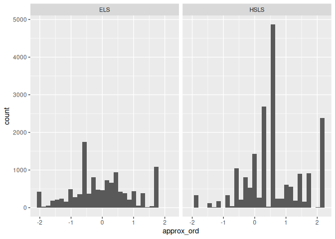
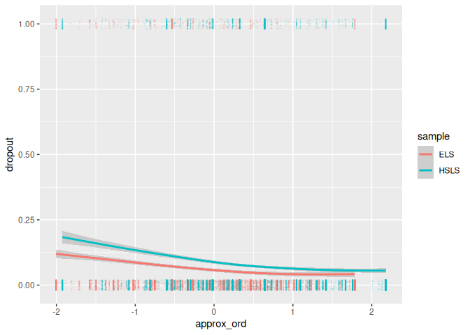
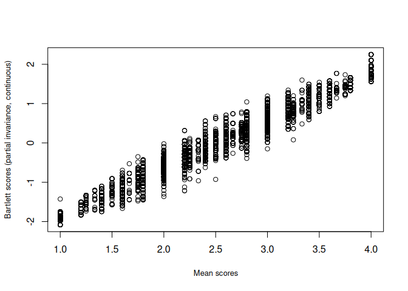
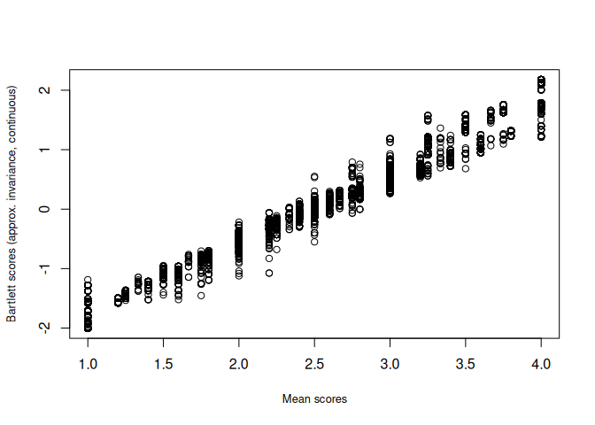
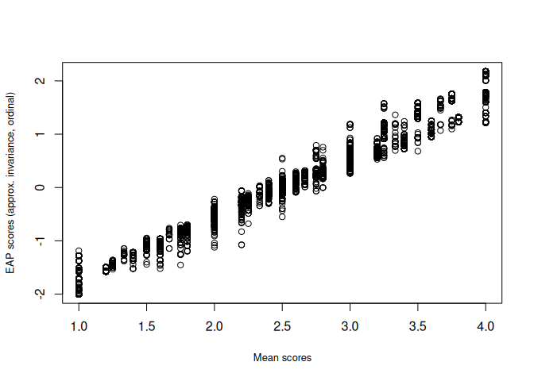

Part4_Analyses_on_Harmonized_Data
================
2024-09-18

This file assumes that the code in `Part1_Harmonization_continuous.Rmd`,
`Part2_Harmonization_ordinal.Rmd`, and `Part3_Results.Rmd` have been
run. These files result in the `df.rds` file that will be read in within
the current file. If those files have not been run yet, please run the
files before executing the code below.

# Install and load packages, prepare data.

``` r
library(dplyr)
library(lavaan)
library(sirt)
library(mirt)
library(kableExtra)
library(here)
library(ggplot2)
library(umx)
# also install packages: haven, numDeriv
```

``` r
score_df_cont <- readRDS("rds/score_df_continuous.rds")
score_df_ord <- readRDS("rds/score_df_ord.rds")
df <- cbind(score_df_cont, score_df_ord[,c("approx_ord", "approx_ord_SE", "approx_ord_rel", "approx_ord_ev")])
head(df, 2)
```

    ##      stu_id sample sex dropout i1 i2 i3 i4 i5 mean_score partial_cont partial_SE
    ## ELS1 101101    ELS   0       0  2  1  2  2  1        1.6    -1.114292   0.278666
    ## ELS2 101102    ELS   0       0  4  3  4  4  4        3.8     1.658808   0.278666
    ##      approx_cont approx_SE partial_rel approx_rel partial_ev  approx_ev approx_ord
    ## ELS1   -1.131463 0.2781254    0.927941  0.9282002 0.07765475 0.07735375  -1.018915
    ## ELS2    1.661305 0.2781254    0.927941  0.9282002 0.07765475 0.07735375   1.312507
    ##      approx_ord_SE approx_ord_rel approx_ord_ev
    ## ELS1     0.2476258      0.9386815    0.05755857
    ## ELS2     0.2987173      0.9107680    0.08126969

``` r
dim(df)
```

    ## [1] 39700    22

``` r
# outcome variable: dropout
table(df$dropout)
```

    ## 
    ##     0     1 
    ## 36536  3164

``` r
round(table(df[df$sample == "ELS", ]$dropout) / 
        sum(table(df[df$sample == "ELS", ]$dropout)), 3)
```

    ## 
    ##     0     1 
    ## 0.927 0.073

``` r
round(table(df[df$sample == "HSLS", ]$dropout) / 
        sum(table(df[df$sample == "HSLS", ]$dropout)), 3)
```

    ## 
    ##     0     1 
    ## 0.916 0.084

# Descriptive Statistics

``` r
ggplot(df, aes(x = approx_ord)) +
  geom_histogram() +
  facet_wrap(~ sample)
```

    ## `stat_bin()` using `bins = 30`. Pick better value with `binwidth`.

    ## Warning: Removed 8951 rows containing non-finite values (`stat_bin()`).

<!-- -->

``` r
ggplot(df, aes(x = approx_ord, y = dropout, col = sample)) +
  geom_jitter(width = 0, height = 0.02, alpha = 0.1,
              size = 0.1) +
  geom_smooth()
```

    ## `geom_smooth()` using method = 'gam' and formula = 'y ~ s(x, bs = "cs")'

    ## Warning: Removed 8951 rows containing non-finite values (`stat_smooth()`).

    ## Warning: Removed 8951 rows containing missing values (`geom_point()`).

<!-- -->

# EAP Factor score regression (no reliability adjustment)

## Using EAP scores to predict dropout with probit regression

``` r
# Warning: the code requires data to be sorted by `sample` before analyses
glm_approx_ord_int <- glm("dropout ~ approx_ord * sample", data = df, 
                      family = "binomial")
summary(glm_approx_ord_int)
```

    ## 
    ## Call:
    ## glm(formula = "dropout ~ approx_ord * sample", family = "binomial", 
    ##     data = df)
    ## 
    ## Coefficients:
    ##                       Estimate Std. Error z value Pr(>|z|)    
    ## (Intercept)           -2.74290    0.03975 -69.007   <2e-16 ***
    ## approx_ord            -0.34968    0.04119  -8.489   <2e-16 ***
    ## sampleHSLS             0.43888    0.04949   8.869   <2e-16 ***
    ## approx_ord:sampleHSLS  0.01285    0.05086   0.253    0.801    
    ## ---
    ## Signif. codes:  0 '***' 0.001 '**' 0.01 '*' 0.05 '.' 0.1 ' ' 1
    ## 
    ## (Dispersion parameter for binomial family taken to be 1)
    ## 
    ##     Null deviance: 15956  on 30748  degrees of freedom
    ## Residual deviance: 15731  on 30745  degrees of freedom
    ##   (8951 observations deleted due to missingness)
    ## AIC: 15739
    ## 
    ## Number of Fisher Scoring iterations: 5

``` r
# interaction not significant
glm_approx_ord_main <- glm("dropout ~ approx_ord + sample", data = df, 
                      family = "binomial")
summary(glm_approx_ord_main)
```

    ## 
    ## Call:
    ## glm(formula = "dropout ~ approx_ord + sample", family = "binomial", 
    ##     data = df)
    ## 
    ## Coefficients:
    ##             Estimate Std. Error z value Pr(>|z|)    
    ## (Intercept) -2.74065    0.03868  -70.85   <2e-16 ***
    ## approx_ord  -0.34125    0.02416  -14.13   <2e-16 ***
    ## sampleHSLS   0.43833    0.04936    8.88   <2e-16 ***
    ## ---
    ## Signif. codes:  0 '***' 0.001 '**' 0.01 '*' 0.05 '.' 0.1 ' ' 1
    ## 
    ## (Dispersion parameter for binomial family taken to be 1)
    ## 
    ##     Null deviance: 15956  on 30748  degrees of freedom
    ## Residual deviance: 15731  on 30746  degrees of freedom
    ##   (8951 observations deleted due to missingness)
    ## AIC: 15737
    ## 
    ## Number of Fisher Scoring iterations: 5

## Using `umx` with EAP scores (pooled analysis without unreliability adjustment)

``` r
# create a dummy variable for the HSLS sample (n_group - 1 dummy variables needed)
df$HSLS <- 0
df$HSLS <- as.integer(df$sample == "HSLS")
```

``` r
# Recode discrete variable to be used with OpenMx
df$dropout_f <- mxFactor(df$dropout, levels = c(0, 1))
```

``` r
probitreg_umx_approx_ord <- umxRAM("
    dropout_f ~ approx_ord + HSLS
    dropout_f ~ 0 * 1
    dropout_f ~~ 1 * dropout_f
  ",
  data = df,
  tryHard = "ordinal")
```

Beginning initial fit attemptFit attempt 0, fit=160581.214719067, new
current best! (was 194890.357129042)Beginning fit attempt 1 of at
maximum 10 extra tries Beginning fit attempt 2 of at maximum 10 extra
triesFit attempt 2, fit=160581.21471898, new current best! (was
160581.214719067)Beginning fit attempt 3 of at maximum 10 extra tries
Fit attempt 3, fit=160581.214718976, new current best! (was
160581.21471898)Beginning fit attempt 4 of at maximum 10 extra tries
Beginning fit attempt 5 of at maximum 10 extra triesFit attempt 5,
fit=160581.214718974, new current best! (was 160581.214718976)Beginning
fit attempt 6 of at maximum 10 extra tries Beginning fit attempt 7 of at
maximum 10 extra triesFit attempt 7, fit=160581.214718974, new current
best! (was 160581.214718974)Beginning fit attempt 8 of at maximum 10
extra tries Beginning fit attempt 9 of at maximum 10 extra
triesBeginning fit attempt 10 of at maximum 10 extra triesFit attempt
10, fit=160581.214718974, new current best! (was 160581.214718974)Final
run, for Hessian and/or standard errors and/or confidence intervals
\[1\] “Warning calling mxRefModels: mxRefModels can’t handle all
designs, including twin, and WLS
<https://github.com/OpenMx/OpenMx/issues/184>”

|     | name                       | Estimate | SE    | type          |
|:----|:---------------------------|---------:|:------|:--------------|
| 4   | approx_ord_with_HSLS       |    0.150 | 0.003 | Manifest Cov  |
| 1   | approx_ord_to_dropout_f    |   -0.166 | 0.012 | Manifest path |
| 2   | HSLS_to_dropout_f          |    0.176 | 0.02  | Manifest path |
| 7   | one_to_approx_ord          |    0.364 | 0.006 | Mean          |
| 8   | one_to_HSLS                |    0.592 | 0.002 | Mean          |
| 3   | approx_ord_with_approx_ord |    0.949 | 0.008 | Residual      |
| 5   | HSLS_with_HSLS             |    0.242 | 0.002 | Residual      |
| 6   | dropout_f_with_dropout_f   |    1.000 | 0     | Residual      |

Parameter loadings for model ‘m1’

Algebra’threshMat’ = 1.468CI95\[1.439, 1.497\]. p-value \< 0.001

``` r
# plot(probitreg_umx_approx_ord) 
```

# Two-Stage Path Analysis with EAP scores

Adjusting for measurement error

``` r
# drop rows with missing reliability
df2 <- df[!is.na(df$approx_ord_rel), ]

# Reliability `approx_ord_rel` defined as 1 - approx_ord_SE^2 / psi_align_ord 
# (computed for each observation using the psi value for the correct group, see 
# `Part2_Harmonization_ordinal.Rmd` for details)

# Error variance `approx_ord_ev` defined as approx_ord_SE^2 * approx_ord_rel

probitreg_2spa_approx_ord <- umxRAM(
    "2spa",
    # Main effects of EAP scores and study indicators
    umxPath(c("eta", "ELS"), to = "dropout_f"),
    # Loading = reliability (as definition variable)
    umxPath("eta", to = "approx_ord", labels = "data.approx_ord_rel", free = FALSE),
    # Error variance (as definition variable)
    umxPath(var = "approx_ord", labels = "data.approx_ord_ev", free = FALSE),
    # Covariances of predictors
    umxPath(unique.pairs = c("eta", "ELS")),
    # Means of predictors
    umxPath(means = c("eta", "ELS")),
    # For model identification: Fix latent variate to be standard normal
    umxPath(v1m0 = "dropout_f"),
    data = df2,
    tryHard = "ordinal"
)
```

Beginning initial fit attemptMxComputeGradientDescent(SLSQP) evaluations
274 fit 103782 change -0.04245 Fit attempt 0, fit=103782.225063401, new
current best! (was 125731.81625397)Beginning fit attempt 1 of at maximum
10 extra tries Fit attempt 1, fit=103782.2250634, new current best! (was
103782.225063401)Beginning fit attempt 2 of at maximum 10 extra tries
MxComputeGradientDescent(SLSQP) evaluations 18 fit 106826 Beginning fit
attempt 3 of at maximum 10 extra triesMxComputeGradientDescent(SLSQP)
evaluations 114 fit 103801 change -1.133 Beginning fit attempt 4 of at
maximum 10 extra triesMxComputeGradientDescent(SLSQP) evaluations 270
fit 103782 change -0.1844 Fit attempt 4, fit=103782.2250634, new current
best! (was 103782.2250634)Beginning fit attempt 5 of at maximum 10 extra
tries Beginning fit attempt 6 of at maximum 10 extra
triesMxComputeGradientDescent(SLSQP) evaluations 18 fit 104501 Beginning
fit attempt 7 of at maximum 10 extra
triesMxComputeGradientDescent(SLSQP) evaluations 158 fit 104505 change
-14.65 Beginning fit attempt 8 of at maximum 10 extra
triesMxComputeGradientDescent(SLSQP) evaluations 241 fit 103782 change
-3.039e-05 Beginning fit attempt 9 of at maximum 10 extra triesBeginning
fit attempt 10 of at maximum 10 extra
triesMxComputeGradientDescent(SLSQP) evaluations 152 fit 103792 change
-2.863 Final run, for Hessian and/or standard errors and/or confidence
intervals \[1\] “Warning calling mxRefModels: mxRefModels can’t handle
all designs, including twin, and WLS
<https://github.com/OpenMx/OpenMx/issues/184>”

|     | name                     | Estimate | SE     | type            |
|:----|:-------------------------|---------:|:-------|:----------------|
| 7   | ELS_with_eta             |    0.367 | 41.34  | Factor Cov      |
| 1   | data.approx_ord_rel      |    0.939 | 0      | Factor loading  |
| 2   | eta_to_dropout_f         |   -1.348 | 67.986 | Factor loading  |
| 3   | ELS_to_dropout_f         |    1.883 | 9.404  | Factor loading  |
| 6   | eta_with_eta             |    1.104 | 0.01   | Factor Variance |
| 8   | ELS_with_ELS             |    8.995 | 227.58 | Factor Variance |
| 9   | one_to_eta               |    0.433 | 0.006  | Mean            |
| 10  | one_to_ELS               |   -4.698 | 56.592 | Mean            |
| 4   | data.approx_ord_ev       |    0.058 | 0      | Residual        |
| 5   | dropout_f_with_dropout_f |    1.000 | 0      | Residual        |

Parameter loadings for model ‘2spa’

Algebra’threshMat’ = -1.044CI95\[-121.302, 119.214\]. p-value = 0.986

# Bartlett Factor score regression (no reliability adjustment)

## Using Bartlett scores to predict dropout with probit regression

Bartlett scores computed using the approximate invariance model assuming
continuous data.

``` r
glm_approx_cont_int <- glm("dropout ~ approx_cont * sample", data = df, 
                      family = "binomial")
summary(glm_approx_cont_int)
```

    ## 
    ## Call:
    ## glm(formula = "dropout ~ approx_cont * sample", family = "binomial", 
    ##     data = df)
    ## 
    ## Coefficients:
    ##                        Estimate Std. Error z value Pr(>|z|)    
    ## (Intercept)            -2.74658    0.03990 -68.832   <2e-16 ***
    ## approx_cont            -0.32709    0.03787  -8.637   <2e-16 ***
    ## sampleHSLS              0.41022    0.04893   8.384   <2e-16 ***
    ## approx_cont:sampleHSLS -0.02738    0.04828  -0.567    0.571    
    ## ---
    ## Signif. codes:  0 '***' 0.001 '**' 0.01 '*' 0.05 '.' 0.1 ' ' 1
    ## 
    ## (Dispersion parameter for binomial family taken to be 1)
    ## 
    ##     Null deviance: 15956  on 30748  degrees of freedom
    ## Residual deviance: 15718  on 30745  degrees of freedom
    ##   (8951 observations deleted due to missingness)
    ## AIC: 15726
    ## 
    ## Number of Fisher Scoring iterations: 5

``` r
# interaction not significant
glm_approx_cont_main <- glm("dropout ~ approx_cont + sample", data = df, 
                      family = "binomial")
summary(glm_approx_cont_main)
```

    ## 
    ## Call:
    ## glm(formula = "dropout ~ approx_cont + sample", family = "binomial", 
    ##     data = df)
    ## 
    ## Coefficients:
    ##             Estimate Std. Error z value Pr(>|z|)    
    ## (Intercept) -2.75191    0.03892 -70.702   <2e-16 ***
    ## approx_cont -0.34396    0.02354 -14.614   <2e-16 ***
    ## sampleHSLS   0.41266    0.04891   8.436   <2e-16 ***
    ## ---
    ## Signif. codes:  0 '***' 0.001 '**' 0.01 '*' 0.05 '.' 0.1 ' ' 1
    ## 
    ## (Dispersion parameter for binomial family taken to be 1)
    ## 
    ##     Null deviance: 15956  on 30748  degrees of freedom
    ## Residual deviance: 15718  on 30746  degrees of freedom
    ##   (8951 observations deleted due to missingness)
    ## AIC: 15724
    ## 
    ## Number of Fisher Scoring iterations: 5

Bartlett scores computed using the partial invariance model assuming
continuous data.

``` r
glm_partial_cont_int <- glm("dropout ~ partial_cont * sample", data = df, 
                      family = "binomial")
summary(glm_partial_cont_int)
```

    ## 
    ## Call:
    ## glm(formula = "dropout ~ partial_cont * sample", family = "binomial", 
    ##     data = df)
    ## 
    ## Coefficients:
    ##                         Estimate Std. Error z value Pr(>|z|)    
    ## (Intercept)             -2.74672    0.03991 -68.826   <2e-16 ***
    ## partial_cont            -0.32764    0.03789  -8.648   <2e-16 ***
    ## sampleHSLS               0.42204    0.04911   8.594   <2e-16 ***
    ## partial_cont:sampleHSLS -0.07610    0.05099  -1.492    0.136    
    ## ---
    ## Signif. codes:  0 '***' 0.001 '**' 0.01 '*' 0.05 '.' 0.1 ' ' 1
    ## 
    ## (Dispersion parameter for binomial family taken to be 1)
    ## 
    ##     Null deviance: 15956  on 30748  degrees of freedom
    ## Residual deviance: 15718  on 30745  degrees of freedom
    ##   (8951 observations deleted due to missingness)
    ## AIC: 15726
    ## 
    ## Number of Fisher Scoring iterations: 5

``` r
# interaction not significant
glm_partial_cont_main <- glm("dropout ~ partial_cont + sample", data = df, 
                      family = "binomial")
summary(glm_partial_cont_main)
```

    ## 
    ## Call:
    ## glm(formula = "dropout ~ partial_cont + sample", family = "binomial", 
    ##     data = df)
    ## 
    ## Coefficients:
    ##              Estimate Std. Error z value Pr(>|z|)    
    ## (Intercept)  -2.76050    0.03920 -70.430   <2e-16 ***
    ## partial_cont -0.36979    0.02549 -14.508   <2e-16 ***
    ## sampleHSLS    0.42649    0.04951   8.615   <2e-16 ***
    ## ---
    ## Signif. codes:  0 '***' 0.001 '**' 0.01 '*' 0.05 '.' 0.1 ' ' 1
    ## 
    ## (Dispersion parameter for binomial family taken to be 1)
    ## 
    ##     Null deviance: 15956  on 30748  degrees of freedom
    ## Residual deviance: 15720  on 30746  degrees of freedom
    ##   (8951 observations deleted due to missingness)
    ## AIC: 15726
    ## 
    ## Number of Fisher Scoring iterations: 5

## Using `umx` with Bartlett scores (pooled analysis without unreliability adjustment)

Bartlett scores computed using the approximate invariance model assuming
continuous data.

``` r
probitreg_umx_approx_cont <- umxRAM("
    dropout_f ~ approx_cont + ELS
    dropout_f ~ 0 * 1
    dropout_f ~~ 1 * dropout_f
  ",
  data = df,
  tryHard = "yes")
```

Beginning initial fit attemptFit attempt 0, fit=107503.973485902, new
current best! (was 119667.063767872)Beginning fit attempt 1 of at
maximum 10 extra tries Fit attempt 1, fit=107503.973485902, new current
best! (was 107503.973485902)Beginning fit attempt 2 of at maximum 10
extra tries Beginning fit attempt 3 of at maximum 10 extra
triesBeginning fit attempt 4 of at maximum 10 extra
triesMxComputeGradientDescent(SLSQP) evaluations 18 fit 115054 Beginning
fit attempt 5 of at maximum 10 extra triesBeginning fit attempt 6 of at
maximum 10 extra triesBeginning fit attempt 7 of at maximum 10 extra
triesBeginning fit attempt 8 of at maximum 10 extra triesBeginning fit
attempt 9 of at maximum 10 extra triesBeginning fit attempt 10 of at
maximum 10 extra tries \[1\] “Warning calling mxRefModels: mxRefModels
can’t handle all designs, including twin, and WLS
<https://github.com/OpenMx/OpenMx/issues/184>”

|     | name                         | Estimate | SE    | type                |
|:----|:-----------------------------|---------:|:------|:--------------------|
| 2   | ELS_to_dropout_f             |    1.855 | 9.046 | Factor loading      |
| 6   | ELS_with_ELS                 |    1.576 |       | Factor Variance     |
| 4   | approx_cont_with_ELS         |    0.248 | 2.032 | Latent-Manifest Cov |
| 1   | approx_cont_to_dropout_f     |   -0.840 | 4.763 | Manifest path       |
| 7   | one_to_approx_cont           |    0.308 | 0.006 | Mean                |
| 8   | one_to_ELS                   |   -0.494 | 4.869 | Mean                |
| 3   | approx_cont_with_approx_cont |    0.948 | 0.008 | Residual            |
| 5   | dropout_f_with_dropout_f     |    1.000 | 0     | Residual            |

Parameter loadings for model ‘m1’

Algebra’threshMat’ = 2.362CI95\[NaN, NaN\]. p-value = NaN

``` r
# plot(probitreg_umx_approx_cont) 
```

Bartlett scores computed using the partial invariance model assuming
continuous data.

``` r
probitreg_umx_partial_cont <- umxRAM("
    dropout_f ~ partial_cont + ELS
    dropout_f ~ 0 * 1
    dropout_f ~~ 1 * dropout_f
  ",
  data = df,
  tryHard = "yes")
```

Beginning initial fit attemptFit attempt 0, fit=103533.190539205, new
current best! (was 114604.992587413)Beginning fit attempt 1 of at
maximum 10 extra tries Fit attempt 1, fit=103533.190539071, new current
best! (was 103533.190539205)Beginning fit attempt 2 of at maximum 10
extra tries Beginning fit attempt 3 of at maximum 10 extra
triesMxComputeGradientDescent(SLSQP) evaluations 18 fit 106289 Beginning
fit attempt 4 of at maximum 10 extra triesBeginning fit attempt 5 of at
maximum 10 extra triesBeginning fit attempt 6 of at maximum 10 extra
tries \[1\] “Warning calling mxRefModels: mxRefModels can’t handle all
designs, including twin, and WLS
<https://github.com/OpenMx/OpenMx/issues/184>”

|     | name                           | Estimate | SE     | type                |
|:----|:-------------------------------|---------:|:-------|:--------------------|
| 2   | ELS_to_dropout_f               |    1.040 | 13.158 | Factor loading      |
| 6   | ELS_with_ELS                   |    1.691 | 22.768 | Factor Variance     |
| 4   | ELS_with_partial_cont          |   -0.378 | 8.065  | Latent-Manifest Cov |
| 1   | partial_cont_to_dropout_f      |    0.228 | 10.676 | Manifest path       |
| 7   | one_to_partial_cont            |    0.288 | 0.005  | Mean                |
| 8   | one_to_ELS                     |    0.102 | 9.77   | Mean                |
| 3   | partial_cont_with_partial_cont |    0.833 | 0.007  | Residual            |
| 5   | dropout_f_with_dropout_f       |    1.000 | 0      | Residual            |

Parameter loadings for model ‘m1’

Algebra’threshMat’ = 2.481CI95\[-47.124, 52.086\]. p-value = 0.922

``` r
# plot(probitreg_umx_partial_cont) 
```

# Two-Stage Path Analysis with Bartlett scores

Adjusting for measurement error

``` r
# drop rows with missing reliability
df3 <- df[!is.na(df$approx_rel), ]

# Reliability set to 1 for Bartlett scores ("values = 1" below)
# Error variance `approx_ev` defined as approx_SE^2

probitreg_2spa_approx_cont <- umxRAM(
    "2spa",
    # Main effects of Bartlett scores and study indicators
    umxPath(c("eta", "ELS"), to = "dropout_f"),
    # Loading = reliability (as definition variable)
    umxPath("eta", to = "approx_cont", values = 1, free = FALSE),
    # Error variance (as definition variable)
    umxPath(var = "approx_cont", labels = "data.approx_ev", free = FALSE),
    # Covariances of predictors
    umxPath(unique.pairs = c("eta", "ELS")),
    # Means of predictors
    umxPath(means = c("eta", "ELS")),
    # For model identification: Fix latent variate to be standard normal
    umxPath(v1m0 = "dropout_f"),
    data = df3,
    tryHard = "yes"
)
```

Beginning initial fit attemptFit attempt 0, fit=101169.172906809, new
current best! (was 118762.546436518)Beginning fit attempt 1 of at
maximum 10 extra tries Fit attempt 1, fit=101169.172906809, new current
best! (was 101169.172906809)Beginning fit attempt 2 of at maximum 10
extra tries Beginning fit attempt 3 of at maximum 10 extra
triesBeginning fit attempt 4 of at maximum 10 extra triesBeginning fit
attempt 5 of at maximum 10 extra triesMxComputeNumericDeriv 1/36
Beginning fit attempt 6 of at maximum 10 extra triesBeginning fit
attempt 7 of at maximum 10 extra triesBeginning fit attempt 8 of at
maximum 10 extra triesBeginning fit attempt 9 of at maximum 10 extra
triesBeginning fit attempt 10 of at maximum 10 extra tries \[1\]
“Warning calling mxRefModels: mxRefModels can’t handle all designs,
including twin, and WLS <https://github.com/OpenMx/OpenMx/issues/184>”

|     | name                     | Estimate | SE      | type            |
|:----|:-------------------------|---------:|:--------|:----------------|
| 7   | ELS_with_eta             |   -0.835 | 145.485 | Factor Cov      |
| 1   | eta_to_approx_cont       |    1.000 | 0       | Factor loading  |
| 2   | eta_to_dropout_f         |    0.011 | 34.041  | Factor loading  |
| 3   | ELS_to_dropout_f         |    0.181 | 4.966   | Factor loading  |
| 6   | eta_with_eta             |    0.862 | 0.008   | Factor Variance |
| 8   | ELS_with_ELS             |    4.675 | 925.673 | Factor Variance |
| 9   | one_to_eta               |    0.315 | 0.006   | Mean            |
| 10  | one_to_ELS               |   -2.601 | 272.966 | Mean            |
| 4   | data.approx_ev           |    0.077 | 0       | Residual        |
| 5   | dropout_f_with_dropout_f |    1.000 | 0       | Residual        |

Parameter loadings for model ‘2spa’

Algebra’threshMat’ = 1.097CI95\[-113.001, 115.195\]. p-value = 0.985

``` r
# drop rows with missing reliability
df4 <- df[!is.na(df$partial_rel), ]

# Reliability set to 1 for Bartlett scores ("values = 1" below)
# Error variance `partial_ev` defined as partial_SE^2

probitreg_2spa_partial_cont <- umxRAM(
    "2spa",
    # Main effects of Bartlett scores and study indicators
    umxPath(c("eta", "ELS"), to = "dropout_f"),
    # Loading = reliability (as definition variable)
    umxPath("eta", to = "partial_cont", values = 1, free = FALSE),
    # Error variance (as definition variable)
    umxPath(var = "partial_cont", labels = "data.partial_ev", free = FALSE),
    # Covariances of predictors
    umxPath(unique.pairs = c("eta", "ELS")),
    # Means of predictors
    umxPath(means = c("eta", "ELS")),
    # For model identification: Fix latent variate to be standard normal
    umxPath(v1m0 = "dropout_f"),
    data = df4,
    tryHard = "yes"
)
```

Beginning initial fit attemptFit attempt 0, fit=97009.6593867169, new
current best! (was 113951.514802665)Beginning fit attempt 1 of at
maximum 10 extra tries Fit attempt 1, fit=97009.6593867169, new current
best! (was 97009.6593867169)Beginning fit attempt 2 of at maximum 10
extra tries Beginning fit attempt 3 of at maximum 10 extra
triesBeginning fit attempt 4 of at maximum 10 extra triesBeginning fit
attempt 5 of at maximum 10 extra triesMxComputeNumericDeriv 1/36
Beginning fit attempt 6 of at maximum 10 extra triesBeginning fit
attempt 7 of at maximum 10 extra triesBeginning fit attempt 8 of at
maximum 10 extra triesBeginning fit attempt 9 of at maximum 10 extra
triesBeginning fit attempt 10 of at maximum 10 extra tries \[1\]
“Warning calling mxRefModels: mxRefModels can’t handle all designs,
including twin, and WLS <https://github.com/OpenMx/OpenMx/issues/184>”

|     | name                     | Estimate | SE      | type            |
|:----|:-------------------------|---------:|:--------|:----------------|
| 7   | ELS_with_eta             |   -0.936 | 79.902  | Factor Cov      |
| 1   | eta_to_partial_cont      |    1.000 | 0       | Factor loading  |
| 2   | eta_to_dropout_f         |    1.419 | 162.543 | Factor loading  |
| 3   | ELS_to_dropout_f         |    1.503 |         | Factor loading  |
| 6   | eta_with_eta             |    0.748 | 0.007   | Factor Variance |
| 8   | ELS_with_ELS             |    4.203 | 333.275 | Factor Variance |
| 9   | one_to_eta               |    0.298 | 0.005   | Mean            |
| 10  | one_to_ELS               |   -1.275 | 142.896 | Mean            |
| 4   | data.partial_ev          |    0.078 | 0       | Residual        |
| 5   | dropout_f_with_dropout_f |    1.000 | 0       | Residual        |

Parameter loadings for model ‘2spa’

Algebra’threshMat’ = 2.634CI95\[NaN, NaN\]. p-value = NaN

# Sensitivity Analysis

Using sum/mean scores

``` r
# Scatterplot
plot(x = df$mean_score, y = df$partial_cont, xlab = "Mean scores", 
     ylab = "Bartlett scores (partial invariance, continuous)", cex.lab = 0.8)
```

<!-- -->

``` r
cor(df$mean_score, df$partial_cont, use = "complete")
```

    ## [1] 0.9921757

``` r
plot(x = df$mean_score, y = df$approx_ord, xlab = "Mean scores", 
     ylab = "Bartlett scores (approx. invariance, continuous)", cex.lab = 0.8)
```

<!-- -->

``` r
cor(df$mean_score, df$approx_cont, use = "complete")
```

    ## [1] 0.9925704

``` r
plot(x = df$mean_score, y = df$approx_ord, xlab = "Mean scores",
     ylab = "EAP scores (approx. invariance, ordinal)", cex.lab = 0.8)
```

<!-- -->

``` r
cor(df$mean_score, df$approx_ord, use = "complete")
```

    ## [1] 0.9887612

### Probit regression with mean scores

Note that the scale of the predictors are different, so the coefficients
are not comparable.

``` r
# GLM (probit regression); interaction not significant
glm_meanscore <- glm("dropout ~ mean_score * sample", data = df, 
                      family = "binomial")
summary(glm_meanscore)
```

    ## 
    ## Call:
    ## glm(formula = "dropout ~ mean_score * sample", family = "binomial", 
    ##     data = df)
    ## 
    ## Coefficients:
    ##                       Estimate Std. Error z value Pr(>|z|)    
    ## (Intercept)           -1.71965    0.11465 -14.998  < 2e-16 ***
    ## mean_score            -0.40697    0.04749  -8.570  < 2e-16 ***
    ## sampleHSLS             0.55232    0.16070   3.437 0.000589 ***
    ## mean_score:sampleHSLS -0.05095    0.06178  -0.825 0.409506    
    ## ---
    ## Signif. codes:  0 '***' 0.001 '**' 0.01 '*' 0.05 '.' 0.1 ' ' 1
    ## 
    ## (Dispersion parameter for binomial family taken to be 1)
    ## 
    ##     Null deviance: 15956  on 30748  degrees of freedom
    ## Residual deviance: 15724  on 30745  degrees of freedom
    ##   (8951 observations deleted due to missingness)
    ## AIC: 15732
    ## 
    ## Number of Fisher Scoring iterations: 5

``` r
# interaction not significant
glm_meanscore_main <- glm("dropout ~ mean_score + sample", data = df, 
                      family = "binomial")
summary(glm_meanscore_main)
```

    ## 
    ## Call:
    ## glm(formula = "dropout ~ mean_score + sample", family = "binomial", 
    ##     data = df)
    ## 
    ## Coefficients:
    ##             Estimate Std. Error z value Pr(>|z|)    
    ## (Intercept) -1.65123    0.07873 -20.974   <2e-16 ***
    ## mean_score  -0.43713    0.03046 -14.349   <2e-16 ***
    ## sampleHSLS   0.42632    0.04937   8.635   <2e-16 ***
    ## ---
    ## Signif. codes:  0 '***' 0.001 '**' 0.01 '*' 0.05 '.' 0.1 ' ' 1
    ## 
    ## (Dispersion parameter for binomial family taken to be 1)
    ## 
    ##     Null deviance: 15956  on 30748  degrees of freedom
    ## Residual deviance: 15725  on 30746  degrees of freedom
    ##   (8951 observations deleted due to missingness)
    ## AIC: 15731
    ## 
    ## Number of Fisher Scoring iterations: 5
