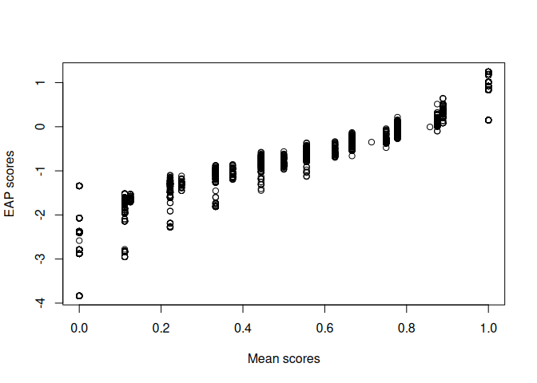

# Alignment Optimization


- [Load Packages](#load-packages)
- [Import Data](#import-data)
- [Configural Model](#configural-model)
  - [Configural Parameters](#configural-parameters)
- [Alignment Optimization](#alignment-optimization)
  - [Quality: Effect size of
    noninvariance](#quality-effect-size-of-noninvariance)
- [Compute Harmonized Factor Scores](#compute-harmonized-factor-scores)
  - [Reliability](#reliability)
- [Analyses of Harmonized Scores](#analyses-of-harmonized-scores)
  - [Descriptives](#descriptives)
  - [Factor score regression (no reliability
    adjustment)](#factor-score-regression-no-reliability-adjustment)
  - [Two-Stage Path Analysis](#two-stage-path-analysis)
- [Sensitivity Analysis](#sensitivity-analysis)

## Load Packages

``` r
library(mirt)       # for IRT analyses
```

    Loading required package: stats4

    Loading required package: lattice

``` r
# install.packages("remotes")
# remotes::install_github("marklhc/pinsearch")
library(pinsearch)  # for noninvariance effect size
library(ggplot2)    # for plotting
library(umx)        # for analyzing harmonized scores
```

    Loading required package: OpenMx

    To take full advantage of multiple cores, use:
      mxOption(key='Number of Threads', value=parallel::detectCores()) #now
      Sys.setenv(OMP_NUM_THREADS=parallel::detectCores()) #before library(OpenMx)

    For an overview type '?umx'


    Attaching package: 'umx'

    The following object is masked from 'package:stats':

        loadings

## Import Data

Data can be downloaded from <https://github.com/jmk7cj/SEM-mnlfa>.

``` r
data <- read.csv(here::here("SEM-mnlfa", "data.csv"))
# Define grouping variable
data$group <- data$study_id
# Sort data by group
data <- data[order(data$group), ]
head(data)
```

         id study_id    sex  race T_TOCA_breakrule T_TOCA_harmpro T_TOCA_breakthg
    1 FT001     FAST   male black                0             NA               0
    2 FT002     FAST   male white                1             NA               0
    3 FT003     FAST female white                0             NA               0
    4 FT004     FAST female white                1             NA               0
    5 FT005     FAST   male black                1             NA               0
    6 FT006     FAST   male black                1             NA               1
      T_TOCA_takeprop T_TOCA_fight T_TOCA_lies T_TOCA_yell T_TOCA_stub T_TOCA_teas
    1               0            0           0           0           0           0
    2               1            1           0           1           1           1
    3               0            0           0           1           0           0
    4               0            1           1           0           1           0
    5               0            1           0           1           1           1
    6               1            1           1           1           1           1
      hs group
    1  1  FAST
    2  1  FAST
    3  1  FAST
    4  0  FAST
    5  1  FAST
    6  1  FAST

``` r
# Sample sizes
# Study 1 = FAST; Study 2 = LIFT; Study 3 = PIRC1;
# Study 4 = PIRC2; Study 5 = SAFE
table(data$study_id)
```


     FAST  LIFT PIRC1 PIRC2  SAFE 
      817   451  1884   639   157 

``` r
item_names <- names(data)[5:13]  # save item names
```

## Configural Model

Run separate mirts (2PL)

``` r
groups <- unique(data$group)
# Initialize output
# a. number of observations per group and item
item_n <- matrix(NA,
    nrow = length(groups),
    ncol = length(item_names),
    dimnames = list(groups, item_names))
# b. Matrix of loadings and intercepts
lambda <- nu <- item_n
# c. Loop over groups, fitting a 2PL model to each
for (g in seq_along(groups)) {
    datg <- data[data$group == groups[g], item_names]
    # Drop completely missing items
    item_n[g, ] <- colSums(!is.na(datg))
    itemsg <- which(colSums(!is.na(datg)) > 0)
    fitg <- mirt(datg[names(itemsg)], model = 1,
                 itemtype = "2PL")
    coefg <- coef(fitg, simplify = TRUE)
    lambda[g, names(itemsg)] <- coefg$items[, "a1"]
    nu[g, names(itemsg)] <- coefg$items[, "d"]
}
```

    Warning: data contains response patterns with only NAs


    Iteration: 1, Log-Lik: -2701.839, Max-Change: 1.34190
    Iteration: 2, Log-Lik: -2463.453, Max-Change: 0.72218
    Iteration: 3, Log-Lik: -2412.010, Max-Change: 0.43110
    Iteration: 4, Log-Lik: -2392.083, Max-Change: 0.30417
    Iteration: 5, Log-Lik: -2383.941, Max-Change: 0.20276
    Iteration: 6, Log-Lik: -2380.398, Max-Change: 0.13371
    Iteration: 7, Log-Lik: -2377.699, Max-Change: 0.05533
    Iteration: 8, Log-Lik: -2377.254, Max-Change: 0.04833
    Iteration: 9, Log-Lik: -2376.981, Max-Change: 0.02805
    Iteration: 10, Log-Lik: -2376.733, Max-Change: 0.02276
    Iteration: 11, Log-Lik: -2376.618, Max-Change: 0.01234
    Iteration: 12, Log-Lik: -2376.534, Max-Change: 0.00950
    Iteration: 13, Log-Lik: -2376.384, Max-Change: 0.01048
    Iteration: 14, Log-Lik: -2376.358, Max-Change: 0.00530
    Iteration: 15, Log-Lik: -2376.338, Max-Change: 0.00516
    Iteration: 16, Log-Lik: -2376.279, Max-Change: 0.00127
    Iteration: 17, Log-Lik: -2376.278, Max-Change: 0.00099
    Iteration: 18, Log-Lik: -2376.278, Max-Change: 0.00087
    Iteration: 19, Log-Lik: -2376.276, Max-Change: 0.00021
    Iteration: 20, Log-Lik: -2376.276, Max-Change: 0.00021
    Iteration: 21, Log-Lik: -2376.276, Max-Change: 0.00021
    Iteration: 22, Log-Lik: -2376.275, Max-Change: 0.00072
    Iteration: 23, Log-Lik: -2376.275, Max-Change: 0.00052
    Iteration: 24, Log-Lik: -2376.275, Max-Change: 0.00069
    Iteration: 25, Log-Lik: -2376.275, Max-Change: 0.00021
    Iteration: 26, Log-Lik: -2376.275, Max-Change: 0.00050
    Iteration: 27, Log-Lik: -2376.275, Max-Change: 0.00016
    Iteration: 28, Log-Lik: -2376.275, Max-Change: 0.00015
    Iteration: 29, Log-Lik: -2376.275, Max-Change: 0.00049
    Iteration: 30, Log-Lik: -2376.275, Max-Change: 0.00012
    Iteration: 31, Log-Lik: -2376.275, Max-Change: 0.00010
    Iteration: 32, Log-Lik: -2376.275, Max-Change: 0.00036
    Iteration: 33, Log-Lik: -2376.275, Max-Change: 0.00048
    Iteration: 34, Log-Lik: -2376.275, Max-Change: 0.00015
    Iteration: 35, Log-Lik: -2376.275, Max-Change: 0.00040
    Iteration: 36, Log-Lik: -2376.275, Max-Change: 0.00012
    Iteration: 37, Log-Lik: -2376.275, Max-Change: 0.00011
    Iteration: 38, Log-Lik: -2376.275, Max-Change: 0.00036
    Iteration: 39, Log-Lik: -2376.275, Max-Change: 0.00009

    Warning: data contains response patterns with only NAs


    Iteration: 1, Log-Lik: -866.529, Max-Change: 1.38272
    Iteration: 2, Log-Lik: -773.763, Max-Change: 0.93477
    Iteration: 3, Log-Lik: -752.996, Max-Change: 0.66499
    Iteration: 4, Log-Lik: -745.988, Max-Change: 0.47619
    Iteration: 5, Log-Lik: -743.015, Max-Change: 0.32199
    Iteration: 6, Log-Lik: -741.639, Max-Change: 0.24704
    Iteration: 7, Log-Lik: -740.333, Max-Change: 0.11340
    Iteration: 8, Log-Lik: -740.227, Max-Change: 0.09039
    Iteration: 9, Log-Lik: -740.160, Max-Change: 0.06572
    Iteration: 10, Log-Lik: -740.057, Max-Change: 0.02925
    Iteration: 11, Log-Lik: -740.039, Max-Change: 0.01853
    Iteration: 12, Log-Lik: -740.024, Max-Change: 0.01111
    Iteration: 13, Log-Lik: -739.997, Max-Change: 0.01445
    Iteration: 14, Log-Lik: -739.990, Max-Change: 0.00956
    Iteration: 15, Log-Lik: -739.985, Max-Change: 0.00817
    Iteration: 16, Log-Lik: -739.971, Max-Change: 0.00957
    Iteration: 17, Log-Lik: -739.969, Max-Change: 0.00546
    Iteration: 18, Log-Lik: -739.967, Max-Change: 0.00476
    Iteration: 19, Log-Lik: -739.962, Max-Change: 0.00526
    Iteration: 20, Log-Lik: -739.961, Max-Change: 0.00331
    Iteration: 21, Log-Lik: -739.961, Max-Change: 0.00284
    Iteration: 22, Log-Lik: -739.959, Max-Change: 0.00239
    Iteration: 23, Log-Lik: -739.959, Max-Change: 0.00165
    Iteration: 24, Log-Lik: -739.959, Max-Change: 0.00140
    Iteration: 25, Log-Lik: -739.959, Max-Change: 0.00106
    Iteration: 26, Log-Lik: -739.958, Max-Change: 0.00096
    Iteration: 27, Log-Lik: -739.958, Max-Change: 0.00091
    Iteration: 28, Log-Lik: -739.958, Max-Change: 0.00027
    Iteration: 29, Log-Lik: -739.958, Max-Change: 0.00030
    Iteration: 30, Log-Lik: -739.958, Max-Change: 0.00029
    Iteration: 31, Log-Lik: -739.958, Max-Change: 0.00023
    Iteration: 32, Log-Lik: -739.958, Max-Change: 0.00021
    Iteration: 33, Log-Lik: -739.958, Max-Change: 0.00021
    Iteration: 34, Log-Lik: -739.958, Max-Change: 0.00084
    Iteration: 35, Log-Lik: -739.958, Max-Change: 0.00078
    Iteration: 36, Log-Lik: -739.958, Max-Change: 0.00063
    Iteration: 37, Log-Lik: -739.958, Max-Change: 0.00028
    Iteration: 38, Log-Lik: -739.958, Max-Change: 0.00065
    Iteration: 39, Log-Lik: -739.958, Max-Change: 0.00020
    Iteration: 40, Log-Lik: -739.958, Max-Change: 0.00015
    Iteration: 41, Log-Lik: -739.958, Max-Change: 0.00056
    Iteration: 42, Log-Lik: -739.958, Max-Change: 0.00012
    Iteration: 43, Log-Lik: -739.958, Max-Change: 0.00012
    Iteration: 44, Log-Lik: -739.958, Max-Change: 0.00052
    Iteration: 45, Log-Lik: -739.958, Max-Change: 0.00011
    Iteration: 46, Log-Lik: -739.958, Max-Change: 0.00053
    Iteration: 47, Log-Lik: -739.958, Max-Change: 0.00014
    Iteration: 48, Log-Lik: -739.958, Max-Change: 0.00047
    Iteration: 49, Log-Lik: -739.958, Max-Change: 0.00017
    Iteration: 50, Log-Lik: -739.958, Max-Change: 0.00046
    Iteration: 51, Log-Lik: -739.958, Max-Change: 0.00012
    Iteration: 52, Log-Lik: -739.958, Max-Change: 0.00009

    Warning: data contains response patterns with only NAs


    Iteration: 1, Log-Lik: -8223.527, Max-Change: 0.97353
    Iteration: 2, Log-Lik: -7401.627, Max-Change: 0.66823
    Iteration: 3, Log-Lik: -7226.007, Max-Change: 0.49820
    Iteration: 4, Log-Lik: -7163.834, Max-Change: 0.29288
    Iteration: 5, Log-Lik: -7141.293, Max-Change: 0.19222
    Iteration: 6, Log-Lik: -7131.656, Max-Change: 0.14900
    Iteration: 7, Log-Lik: -7127.390, Max-Change: 0.10689
    Iteration: 8, Log-Lik: -7125.368, Max-Change: 0.06951
    Iteration: 9, Log-Lik: -7124.388, Max-Change: 0.05193
    Iteration: 10, Log-Lik: -7123.488, Max-Change: 0.01236
    Iteration: 11, Log-Lik: -7123.434, Max-Change: 0.00858
    Iteration: 12, Log-Lik: -7123.407, Max-Change: 0.00632
    Iteration: 13, Log-Lik: -7123.363, Max-Change: 0.00362
    Iteration: 14, Log-Lik: -7123.356, Max-Change: 0.00262
    Iteration: 15, Log-Lik: -7123.351, Max-Change: 0.00243
    Iteration: 16, Log-Lik: -7123.332, Max-Change: 0.00084
    Iteration: 17, Log-Lik: -7123.332, Max-Change: 0.00112
    Iteration: 18, Log-Lik: -7123.331, Max-Change: 0.00076
    Iteration: 19, Log-Lik: -7123.331, Max-Change: 0.00052
    Iteration: 20, Log-Lik: -7123.331, Max-Change: 0.00039
    Iteration: 21, Log-Lik: -7123.331, Max-Change: 0.00172
    Iteration: 22, Log-Lik: -7123.330, Max-Change: 0.00113
    Iteration: 23, Log-Lik: -7123.330, Max-Change: 0.00068
    Iteration: 24, Log-Lik: -7123.330, Max-Change: 0.00061
    Iteration: 25, Log-Lik: -7123.329, Max-Change: 0.00050
    Iteration: 26, Log-Lik: -7123.329, Max-Change: 0.00040
    Iteration: 27, Log-Lik: -7123.329, Max-Change: 0.00038
    Iteration: 28, Log-Lik: -7123.329, Max-Change: 0.00030
    Iteration: 29, Log-Lik: -7123.329, Max-Change: 0.00040
    Iteration: 30, Log-Lik: -7123.329, Max-Change: 0.00023
    Iteration: 31, Log-Lik: -7123.329, Max-Change: 0.00025
    Iteration: 32, Log-Lik: -7123.329, Max-Change: 0.00018
    Iteration: 33, Log-Lik: -7123.329, Max-Change: 0.00020
    Iteration: 34, Log-Lik: -7123.329, Max-Change: 0.00014
    Iteration: 35, Log-Lik: -7123.329, Max-Change: 0.00018
    Iteration: 36, Log-Lik: -7123.329, Max-Change: 0.00011
    Iteration: 37, Log-Lik: -7123.329, Max-Change: 0.00012
    Iteration: 38, Log-Lik: -7123.329, Max-Change: 0.00009

    Iteration: 1, Log-Lik: -2691.206, Max-Change: 1.37907
    Iteration: 2, Log-Lik: -2384.546, Max-Change: 0.88232
    Iteration: 3, Log-Lik: -2318.976, Max-Change: 0.53559
    Iteration: 4, Log-Lik: -2296.037, Max-Change: 0.40448
    Iteration: 5, Log-Lik: -2286.737, Max-Change: 0.28161
    Iteration: 6, Log-Lik: -2282.220, Max-Change: 0.20677
    Iteration: 7, Log-Lik: -2278.645, Max-Change: 0.07540
    Iteration: 8, Log-Lik: -2278.051, Max-Change: 0.05908
    Iteration: 9, Log-Lik: -2277.675, Max-Change: 0.04316
    Iteration: 10, Log-Lik: -2277.059, Max-Change: 0.01590
    Iteration: 11, Log-Lik: -2276.930, Max-Change: 0.01428
    Iteration: 12, Log-Lik: -2276.825, Max-Change: 0.01334
    Iteration: 13, Log-Lik: -2276.480, Max-Change: 0.01694
    Iteration: 14, Log-Lik: -2276.450, Max-Change: 0.01265
    Iteration: 15, Log-Lik: -2276.426, Max-Change: 0.01023
    Iteration: 16, Log-Lik: -2276.342, Max-Change: 0.00477
    Iteration: 17, Log-Lik: -2276.335, Max-Change: 0.00608
    Iteration: 18, Log-Lik: -2276.330, Max-Change: 0.00386
    Iteration: 19, Log-Lik: -2276.327, Max-Change: 0.00341
    Iteration: 20, Log-Lik: -2276.322, Max-Change: 0.00234
    Iteration: 21, Log-Lik: -2276.319, Max-Change: 0.00230
    Iteration: 22, Log-Lik: -2276.306, Max-Change: 0.00122
    Iteration: 23, Log-Lik: -2276.306, Max-Change: 0.00192
    Iteration: 24, Log-Lik: -2276.305, Max-Change: 0.00097
    Iteration: 25, Log-Lik: -2276.304, Max-Change: 0.00160
    Iteration: 26, Log-Lik: -2276.304, Max-Change: 0.00066
    Iteration: 27, Log-Lik: -2276.304, Max-Change: 0.00066
    Iteration: 28, Log-Lik: -2276.303, Max-Change: 0.00103
    Iteration: 29, Log-Lik: -2276.302, Max-Change: 0.00077
    Iteration: 30, Log-Lik: -2276.302, Max-Change: 0.00085
    Iteration: 31, Log-Lik: -2276.302, Max-Change: 0.00034
    Iteration: 32, Log-Lik: -2276.302, Max-Change: 0.00012
    Iteration: 33, Log-Lik: -2276.302, Max-Change: 0.00011
    Iteration: 34, Log-Lik: -2276.302, Max-Change: 0.00013
    Iteration: 35, Log-Lik: -2276.302, Max-Change: 0.00012
    Iteration: 36, Log-Lik: -2276.302, Max-Change: 0.00012
    Iteration: 37, Log-Lik: -2276.302, Max-Change: 0.00045
    Iteration: 38, Log-Lik: -2276.302, Max-Change: 0.00046
    Iteration: 39, Log-Lik: -2276.302, Max-Change: 0.00034
    Iteration: 40, Log-Lik: -2276.302, Max-Change: 0.00011
    Iteration: 41, Log-Lik: -2276.302, Max-Change: 0.00039
    Iteration: 42, Log-Lik: -2276.302, Max-Change: 0.00008

    Warning: data contains response patterns with only NAs


    Iteration: 1, Log-Lik: -744.931, Max-Change: 1.23308
    Iteration: 2, Log-Lik: -655.005, Max-Change: 0.95430
    Iteration: 3, Log-Lik: -634.533, Max-Change: 0.80731
    Iteration: 4, Log-Lik: -627.163, Max-Change: 0.58697
    Iteration: 5, Log-Lik: -624.106, Max-Change: 0.43579
    Iteration: 6, Log-Lik: -622.719, Max-Change: 0.33565
    Iteration: 7, Log-Lik: -621.452, Max-Change: 0.10091
    Iteration: 8, Log-Lik: -621.418, Max-Change: 0.07328
    Iteration: 9, Log-Lik: -621.401, Max-Change: 0.05263
    Iteration: 10, Log-Lik: -621.382, Max-Change: 0.01659
    Iteration: 11, Log-Lik: -621.380, Max-Change: 0.01216
    Iteration: 12, Log-Lik: -621.379, Max-Change: 0.00886
    Iteration: 13, Log-Lik: -621.376, Max-Change: 0.00277
    Iteration: 14, Log-Lik: -621.376, Max-Change: 0.00283
    Iteration: 15, Log-Lik: -621.376, Max-Change: 0.00297
    Iteration: 16, Log-Lik: -621.374, Max-Change: 0.00142
    Iteration: 17, Log-Lik: -621.374, Max-Change: 0.00160
    Iteration: 18, Log-Lik: -621.374, Max-Change: 0.00157
    Iteration: 19, Log-Lik: -621.373, Max-Change: 0.00101
    Iteration: 20, Log-Lik: -621.373, Max-Change: 0.00084
    Iteration: 21, Log-Lik: -621.373, Max-Change: 0.00077
    Iteration: 22, Log-Lik: -621.373, Max-Change: 0.00079
    Iteration: 23, Log-Lik: -621.373, Max-Change: 0.00050
    Iteration: 24, Log-Lik: -621.373, Max-Change: 0.00022
    Iteration: 25, Log-Lik: -621.373, Max-Change: 0.00025
    Iteration: 26, Log-Lik: -621.373, Max-Change: 0.00025
    Iteration: 27, Log-Lik: -621.373, Max-Change: 0.00025
    Iteration: 28, Log-Lik: -621.373, Max-Change: 0.00022
    Iteration: 29, Log-Lik: -621.373, Max-Change: 0.00020
    Iteration: 30, Log-Lik: -621.373, Max-Change: 0.00019
    Iteration: 31, Log-Lik: -621.373, Max-Change: 0.00013
    Iteration: 32, Log-Lik: -621.373, Max-Change: 0.00013
    Iteration: 33, Log-Lik: -621.373, Max-Change: 0.00013
    Iteration: 34, Log-Lik: -621.373, Max-Change: 0.00011
    Iteration: 35, Log-Lik: -621.373, Max-Change: 0.00010
    Iteration: 36, Log-Lik: -621.373, Max-Change: 0.00010

### Configural Parameters

``` r
knitr::kable(t(lambda), digits = 2)
```

<div id="tbl-lambda">

Table 1: Configural Loadings

<div class="cell-output-display">

|                  | FAST | LIFT | PIRC1 | PIRC2 | SAFE |
|:-----------------|-----:|-----:|------:|------:|-----:|
| T_TOCA_breakrule | 3.82 | 2.57 |  3.27 |  2.65 | 2.94 |
| T_TOCA_harmpro   |   NA | 5.28 |  1.91 |  4.27 | 4.88 |
| T_TOCA_breakthg  | 2.86 | 3.15 |  3.77 |  4.69 | 4.34 |
| T_TOCA_takeprop  | 3.12 | 2.81 |  3.86 |  4.19 | 6.19 |
| T_TOCA_fight     | 2.22 | 4.08 |  2.86 |  4.28 | 3.51 |
| T_TOCA_lies      | 2.65 | 2.68 |  3.20 |  3.56 | 3.15 |
| T_TOCA_yell      | 3.02 | 5.34 |  2.71 |  2.75 | 3.84 |
| T_TOCA_stub      | 3.06 | 2.48 |  2.50 |  1.92 | 2.02 |
| T_TOCA_teas      | 2.44 | 2.14 |  3.01 |  2.76 | 2.74 |

</div>

</div>

``` r
knitr::kable(t(nu), digits = 2)
```

<div id="tbl-nu">

Table 2: Configural Intercepts

<div class="cell-output-display">

|                  | FAST |  LIFT | PIRC1 | PIRC2 |  SAFE |
|:-----------------|-----:|------:|------:|------:|------:|
| T_TOCA_breakrule | 5.28 |  0.19 |  1.06 |  0.16 |  1.71 |
| T_TOCA_harmpro   |   NA | -5.15 | -0.85 | -3.83 | -2.08 |
| T_TOCA_breakthg  | 0.33 | -3.36 | -2.01 | -5.15 | -1.85 |
| T_TOCA_takeprop  | 1.53 | -2.54 | -0.93 | -3.37 | -0.71 |
| T_TOCA_fight     | 2.53 | -1.41 | -1.22 | -2.51 | -0.34 |
| T_TOCA_lies      | 2.01 | -2.10 | -0.60 | -2.83 |  0.58 |
| T_TOCA_yell      | 3.13 | -1.86 | -0.11 | -1.38 | -0.18 |
| T_TOCA_stub      | 4.08 |  1.99 |  0.91 | -1.08 |  0.27 |
| T_TOCA_teas      | 2.75 |  0.51 |  0.34 | -0.98 |  0.12 |

</div>

</div>

## Alignment Optimization

``` r
aligned <- sirt::invariance.alignment(
    lambda = lambda,
    nu = nu,
    wgt = sqrt(item_n),
    optimizer = "nlminb",
    eps = .0001,
    control = list(maxit = 10000)
)
```

``` r
knitr::kable(t(aligned$lambda.aligned), digits = 2)
```

<div id="tbl-alambda">

Table 3: Aligned Loadings

<div class="cell-output-display">

|                  | FAST | LIFT | PIRC1 | PIRC2 | SAFE |
|:-----------------|-----:|-----:|------:|------:|-----:|
| T_TOCA_breakrule | 3.82 | 1.55 |  2.64 |  1.97 | 1.93 |
| T_TOCA_harmpro   |   NA | 3.18 |  1.55 |  3.18 | 3.20 |
| T_TOCA_breakthg  | 2.86 | 1.90 |  3.04 |  3.49 | 2.85 |
| T_TOCA_takeprop  | 3.12 | 1.70 |  3.12 |  3.12 | 4.07 |
| T_TOCA_fight     | 2.22 | 2.47 |  2.31 |  3.19 | 2.31 |
| T_TOCA_lies      | 2.65 | 1.62 |  2.59 |  2.65 | 2.07 |
| T_TOCA_yell      | 3.02 | 3.22 |  2.19 |  2.05 | 2.52 |
| T_TOCA_stub      | 3.06 | 1.50 |  2.02 |  1.43 | 1.33 |
| T_TOCA_teas      | 2.44 | 1.29 |  2.43 |  2.06 | 1.80 |

</div>

</div>

``` r
knitr::kable(t(aligned$nu.aligned), digits = 2)
```

<div id="tbl-anu">

Table 4: Aligned Intercepts

<div class="cell-output-display">

|                  | FAST |  LIFT | PIRC1 | PIRC2 | SAFE |
|:-----------------|-----:|------:|------:|------:|-----:|
| T_TOCA_breakrule | 5.28 |  2.87 |  3.15 |  3.26 | 3.18 |
| T_TOCA_harmpro   |   NA |  0.37 |  0.37 |  1.17 | 0.37 |
| T_TOCA_breakthg  | 0.33 | -0.06 |  0.39 |  0.35 | 0.33 |
| T_TOCA_takeprop  | 1.53 |  0.40 |  1.53 |  1.53 | 2.41 |
| T_TOCA_fight     | 2.53 |  2.86 |  0.61 |  2.50 | 1.43 |
| T_TOCA_lies      | 2.01 |  0.71 |  1.45 |  1.34 | 2.16 |
| T_TOCA_yell      | 3.13 |  3.72 |  1.62 |  1.84 | 1.74 |
| T_TOCA_stub      | 4.08 |  4.59 |  2.50 |  1.17 | 1.29 |
| T_TOCA_teas      | 2.75 |  2.75 |  2.26 |  2.26 | 1.50 |

</div>

</div>

``` r
knitr::kable(t(aligned$pars), digits = 2)
```

<div id="tbl-apars">

Table 5: Aligned Latent means and variances

<div class="cell-output-display">

|        | FAST |  LIFT | PIRC1 | PIRC2 |  SAFE |
|:-------|-----:|------:|------:|------:|------:|
| alpha0 |    0 | -1.73 | -0.79 | -1.57 | -0.77 |
| psi0   |    1 |  1.66 |  1.24 |  1.34 |  1.52 |

</div>

</div>

### Quality: Effect size of noninvariance

``` r
# Note: we need to do this twice as `pinsearch::fmacs()`
# does not handle NAs in the input, so we need to
# treat item 2 (not in Study 1) separately
# pooled SD
vars <- apply(data[item_names],
    MARGIN = 2,
    FUN = \(x) tapply(x,
        INDEX = data$study_id,
        FUN = var, na.rm = TRUE
    )
)
item_n2 <- ifelse(item_n > 0, item_n, NA)
pooled_sd <- sqrt(
    colSums(vars * (item_n2 - 1), na.rm = TRUE) /
        colSums(item_n2 - 1, na.rm = TRUE)
)

# a. Items 1, 3-9
thres1 <- aligned$nu.aligned[, c(1, 3:9)]
colnames(thres1) <- seq_len(ncol(thres1))
# Noninvariance effect size for items 1, 3-9
f1 <- pinsearch::fmacs_ordered(
    thresholds = thres1,
    loadings = aligned$lambda.aligned[, c(1, 3:9)],
    link = "logit",
    pooled_item_sd = pooled_sd[c(1, 3:9)]
)
# b. Item 2
thres2 <- aligned$nu.aligned[-1, 2, drop = FALSE]
colnames(thres2) <- 1
f2 <- pinsearch::fmacs_ordered(
    thresholds = thres2,
    loadings = aligned$lambda.aligned[-1, 2, drop = FALSE],
    link = "logit",
    pooled_item_sd = pooled_sd[2]
)
# Combine to form one effect size vector
f_effsize <- cbind(f1[1, 1, drop = FALSE], f2, f1[1, -1, drop = FALSE])
knitr::kable(t(f_effsize), digits = 2)
```

|                  | fmacs |
|:-----------------|------:|
| T_TOCA_breakrule |  0.11 |
| T_TOCA_harmpro   |  0.14 |
| T_TOCA_breakthg  |  0.09 |
| T_TOCA_takeprop  |  0.14 |
| T_TOCA_fight     |  0.25 |
| T_TOCA_lies      |  0.16 |
| T_TOCA_yell      |  0.14 |
| T_TOCA_stub      |  0.29 |
| T_TOCA_teas      |  0.18 |

The magnitude of noninvariance effect size is not trivial (with fmacs \>
.1) for most items.

## Compute Harmonized Factor Scores

``` r
# Refit the configural model, with latent means and variances
# from the aligned parameters
aligned_pars <- aligned$pars
# Define a syntax template to allow latent means and
# variances to be substituted by the aligned values
mod <- "
  f = 1-[I]
  START = (GROUP, MEAN_1, [mu]), (GROUP, COV_11, [sigma2])
"
# Substitute into the aligned means and variances
fsg <- NULL  # place holder for factor scores
for (g in seq_along(groups)) {
    datg <- data[data$group == groups[g], item_names]
    # Drop completely missing items
    itemsg <- which(item_n[g, ] > 0)
    modg <- gsub("\\[I\\]", replacement = length(itemsg), mod)
    modg <- gsub("\\[mu\\]", replacement = aligned_pars[g, 1], modg)
    # Note: aligned psi is latent SD, but `mirt`
    # needs latent variance (i.e., SD^2)
    modg <- gsub("\\[sigma2\\]", replacement = aligned_pars[g, 2]^2, modg)
    fitg <- mirt(datg[names(itemsg)], model = modg,
                 itemtype = "2PL")
    fsg <- rbind(
        fsg,
        data.frame(
            fscores(fitg,
                method = "EAP", full.scores.SE = TRUE
            ),
            group = groups[g],
            mean_eta = aligned_pars[g, 1],
            sd_eta = aligned_pars[g, 2]
        )
    )
}
```

    Warning: data contains response patterns with only NAs


    Iteration: 1, Log-Lik: -2701.839, Max-Change: 1.34190
    Iteration: 2, Log-Lik: -2463.453, Max-Change: 0.72218
    Iteration: 3, Log-Lik: -2412.010, Max-Change: 0.43110
    Iteration: 4, Log-Lik: -2392.083, Max-Change: 0.30417
    Iteration: 5, Log-Lik: -2383.941, Max-Change: 0.20276
    Iteration: 6, Log-Lik: -2380.398, Max-Change: 0.13371
    Iteration: 7, Log-Lik: -2377.699, Max-Change: 0.05533
    Iteration: 8, Log-Lik: -2377.254, Max-Change: 0.04833
    Iteration: 9, Log-Lik: -2376.981, Max-Change: 0.02805
    Iteration: 10, Log-Lik: -2376.733, Max-Change: 0.02276
    Iteration: 11, Log-Lik: -2376.618, Max-Change: 0.01234
    Iteration: 12, Log-Lik: -2376.534, Max-Change: 0.00950
    Iteration: 13, Log-Lik: -2376.384, Max-Change: 0.01048
    Iteration: 14, Log-Lik: -2376.358, Max-Change: 0.00530
    Iteration: 15, Log-Lik: -2376.338, Max-Change: 0.00516
    Iteration: 16, Log-Lik: -2376.279, Max-Change: 0.00127
    Iteration: 17, Log-Lik: -2376.278, Max-Change: 0.00099
    Iteration: 18, Log-Lik: -2376.278, Max-Change: 0.00087
    Iteration: 19, Log-Lik: -2376.276, Max-Change: 0.00021
    Iteration: 20, Log-Lik: -2376.276, Max-Change: 0.00021
    Iteration: 21, Log-Lik: -2376.276, Max-Change: 0.00021
    Iteration: 22, Log-Lik: -2376.275, Max-Change: 0.00072
    Iteration: 23, Log-Lik: -2376.275, Max-Change: 0.00052
    Iteration: 24, Log-Lik: -2376.275, Max-Change: 0.00069
    Iteration: 25, Log-Lik: -2376.275, Max-Change: 0.00021
    Iteration: 26, Log-Lik: -2376.275, Max-Change: 0.00050
    Iteration: 27, Log-Lik: -2376.275, Max-Change: 0.00016
    Iteration: 28, Log-Lik: -2376.275, Max-Change: 0.00015
    Iteration: 29, Log-Lik: -2376.275, Max-Change: 0.00049
    Iteration: 30, Log-Lik: -2376.275, Max-Change: 0.00012
    Iteration: 31, Log-Lik: -2376.275, Max-Change: 0.00010
    Iteration: 32, Log-Lik: -2376.275, Max-Change: 0.00036
    Iteration: 33, Log-Lik: -2376.275, Max-Change: 0.00048
    Iteration: 34, Log-Lik: -2376.275, Max-Change: 0.00015
    Iteration: 35, Log-Lik: -2376.275, Max-Change: 0.00040
    Iteration: 36, Log-Lik: -2376.275, Max-Change: 0.00012
    Iteration: 37, Log-Lik: -2376.275, Max-Change: 0.00011
    Iteration: 38, Log-Lik: -2376.275, Max-Change: 0.00036
    Iteration: 39, Log-Lik: -2376.275, Max-Change: 0.00009

    Warning: data contains response patterns with only NAs


    Iteration: 1, Log-Lik: -866.533, Max-Change: 1.23966
    Iteration: 2, Log-Lik: -793.682, Max-Change: 0.48395
    Iteration: 3, Log-Lik: -774.644, Max-Change: 0.37382
    Iteration: 4, Log-Lik: -764.558, Max-Change: 0.31631
    Iteration: 5, Log-Lik: -758.253, Max-Change: 0.29618
    Iteration: 6, Log-Lik: -753.946, Max-Change: 0.26431
    Iteration: 7, Log-Lik: -743.133, Max-Change: 0.15807
    Iteration: 8, Log-Lik: -742.484, Max-Change: 0.09342
    Iteration: 9, Log-Lik: -742.031, Max-Change: 0.08349
    Iteration: 10, Log-Lik: -740.559, Max-Change: 0.06007
    Iteration: 11, Log-Lik: -740.450, Max-Change: 0.04979
    Iteration: 12, Log-Lik: -740.364, Max-Change: 0.04585
    Iteration: 13, Log-Lik: -740.051, Max-Change: 0.01748
    Iteration: 14, Log-Lik: -740.035, Max-Change: 0.01589
    Iteration: 15, Log-Lik: -740.023, Max-Change: 0.01487
    Iteration: 16, Log-Lik: -739.978, Max-Change: 0.01004
    Iteration: 17, Log-Lik: -739.976, Max-Change: 0.00802
    Iteration: 18, Log-Lik: -739.974, Max-Change: 0.00723
    Iteration: 19, Log-Lik: -739.969, Max-Change: 0.00750
    Iteration: 20, Log-Lik: -739.968, Max-Change: 0.00373
    Iteration: 21, Log-Lik: -739.967, Max-Change: 0.00264
    Iteration: 22, Log-Lik: -739.967, Max-Change: 0.00255
    Iteration: 23, Log-Lik: -739.966, Max-Change: 0.00286
    Iteration: 24, Log-Lik: -739.966, Max-Change: 0.00216
    Iteration: 25, Log-Lik: -739.966, Max-Change: 0.00115
    Iteration: 26, Log-Lik: -739.966, Max-Change: 0.00124
    Iteration: 27, Log-Lik: -739.966, Max-Change: 0.00265
    Iteration: 28, Log-Lik: -739.965, Max-Change: 0.00307
    Iteration: 29, Log-Lik: -739.965, Max-Change: 0.00066
    Iteration: 30, Log-Lik: -739.965, Max-Change: 0.00068
    Iteration: 31, Log-Lik: -739.965, Max-Change: 0.00133
    Iteration: 32, Log-Lik: -739.965, Max-Change: 0.00194
    Iteration: 33, Log-Lik: -739.965, Max-Change: 0.00044
    Iteration: 34, Log-Lik: -739.965, Max-Change: 0.00040
    Iteration: 35, Log-Lik: -739.965, Max-Change: 0.00011
    Iteration: 36, Log-Lik: -739.965, Max-Change: 0.00070
    Iteration: 37, Log-Lik: -739.965, Max-Change: 0.00011
    Iteration: 38, Log-Lik: -739.965, Max-Change: 0.00079
    Iteration: 39, Log-Lik: -739.965, Max-Change: 0.00015
    Iteration: 40, Log-Lik: -739.965, Max-Change: 0.00012
    Iteration: 41, Log-Lik: -739.965, Max-Change: 0.00041
    Iteration: 42, Log-Lik: -739.964, Max-Change: 0.00053
    Iteration: 43, Log-Lik: -739.964, Max-Change: 0.00118
    Iteration: 44, Log-Lik: -739.964, Max-Change: 0.00008

    Warning: data contains response patterns with only NAs


    Iteration: 1, Log-Lik: -8039.425, Max-Change: 0.88834
    Iteration: 2, Log-Lik: -7405.722, Max-Change: 0.64594
    Iteration: 3, Log-Lik: -7251.327, Max-Change: 0.32330
    Iteration: 4, Log-Lik: -7195.496, Max-Change: 0.30969
    Iteration: 5, Log-Lik: -7167.166, Max-Change: 0.19066
    Iteration: 6, Log-Lik: -7152.648, Max-Change: 0.12189
    Iteration: 7, Log-Lik: -7144.845, Max-Change: 0.08947
    Iteration: 8, Log-Lik: -7139.814, Max-Change: 0.07054
    Iteration: 9, Log-Lik: -7136.303, Max-Change: 0.06529
    Iteration: 10, Log-Lik: -7131.126, Max-Change: 0.05762
    Iteration: 11, Log-Lik: -7129.591, Max-Change: 0.03820
    Iteration: 12, Log-Lik: -7128.463, Max-Change: 0.03142
    Iteration: 13, Log-Lik: -7126.882, Max-Change: 0.02838
    Iteration: 14, Log-Lik: -7126.301, Max-Change: 0.02486
    Iteration: 15, Log-Lik: -7125.768, Max-Change: 0.02110
    Iteration: 16, Log-Lik: -7123.971, Max-Change: 0.01329
    Iteration: 17, Log-Lik: -7123.853, Max-Change: 0.01148
    Iteration: 18, Log-Lik: -7123.756, Max-Change: 0.00949
    Iteration: 19, Log-Lik: -7123.463, Max-Change: 0.00631
    Iteration: 20, Log-Lik: -7123.437, Max-Change: 0.00481
    Iteration: 21, Log-Lik: -7123.418, Max-Change: 0.00424
    Iteration: 22, Log-Lik: -7123.376, Max-Change: 0.00645
    Iteration: 23, Log-Lik: -7123.366, Max-Change: 0.00298
    Iteration: 24, Log-Lik: -7123.360, Max-Change: 0.00248
    Iteration: 25, Log-Lik: -7123.339, Max-Change: 0.00146
    Iteration: 26, Log-Lik: -7123.338, Max-Change: 0.00083
    Iteration: 27, Log-Lik: -7123.336, Max-Change: 0.00123
    Iteration: 28, Log-Lik: -7123.335, Max-Change: 0.00135
    Iteration: 29, Log-Lik: -7123.334, Max-Change: 0.00114
    Iteration: 30, Log-Lik: -7123.333, Max-Change: 0.00087
    Iteration: 31, Log-Lik: -7123.332, Max-Change: 0.00091
    Iteration: 32, Log-Lik: -7123.331, Max-Change: 0.00064
    Iteration: 33, Log-Lik: -7123.331, Max-Change: 0.00024
    Iteration: 34, Log-Lik: -7123.331, Max-Change: 0.00019
    Iteration: 35, Log-Lik: -7123.331, Max-Change: 0.00012
    Iteration: 36, Log-Lik: -7123.331, Max-Change: 0.00060
    Iteration: 37, Log-Lik: -7123.330, Max-Change: 0.00060
    Iteration: 38, Log-Lik: -7123.330, Max-Change: 0.00013
    Iteration: 39, Log-Lik: -7123.330, Max-Change: 0.00044
    Iteration: 40, Log-Lik: -7123.330, Max-Change: 0.00050
    Iteration: 41, Log-Lik: -7123.330, Max-Change: 0.00023
    Iteration: 42, Log-Lik: -7123.330, Max-Change: 0.00045
    Iteration: 43, Log-Lik: -7123.330, Max-Change: 0.00026
    Iteration: 44, Log-Lik: -7123.330, Max-Change: 0.00039
    Iteration: 45, Log-Lik: -7123.330, Max-Change: 0.00017
    Iteration: 46, Log-Lik: -7123.330, Max-Change: 0.00014
    Iteration: 47, Log-Lik: -7123.330, Max-Change: 0.00034
    Iteration: 48, Log-Lik: -7123.330, Max-Change: 0.00010

    Iteration: 1, Log-Lik: -2752.068, Max-Change: 1.00488
    Iteration: 2, Log-Lik: -2474.889, Max-Change: 0.48329
    Iteration: 3, Log-Lik: -2397.638, Max-Change: 0.34021
    Iteration: 4, Log-Lik: -2359.032, Max-Change: 0.26210
    Iteration: 5, Log-Lik: -2336.196, Max-Change: 0.24034
    Iteration: 6, Log-Lik: -2321.843, Max-Change: 0.23482
    Iteration: 7, Log-Lik: -2311.924, Max-Change: 0.19653
    Iteration: 8, Log-Lik: -2304.379, Max-Change: 0.18105
    Iteration: 9, Log-Lik: -2298.886, Max-Change: 0.16132
    Iteration: 10, Log-Lik: -2294.630, Max-Change: 0.14412
    Iteration: 11, Log-Lik: -2291.261, Max-Change: 0.12338
    Iteration: 12, Log-Lik: -2288.576, Max-Change: 0.11155
    Iteration: 13, Log-Lik: -2278.957, Max-Change: 0.04534
    Iteration: 14, Log-Lik: -2278.516, Max-Change: 0.04511
    Iteration: 15, Log-Lik: -2278.145, Max-Change: 0.04019
    Iteration: 16, Log-Lik: -2276.731, Max-Change: 0.02166
    Iteration: 17, Log-Lik: -2276.661, Max-Change: 0.01864
    Iteration: 18, Log-Lik: -2276.602, Max-Change: 0.01639
    Iteration: 19, Log-Lik: -2276.376, Max-Change: 0.00847
    Iteration: 20, Log-Lik: -2276.364, Max-Change: 0.00721
    Iteration: 21, Log-Lik: -2276.354, Max-Change: 0.00619
    Iteration: 22, Log-Lik: -2276.317, Max-Change: 0.00438
    Iteration: 23, Log-Lik: -2276.315, Max-Change: 0.00320
    Iteration: 24, Log-Lik: -2276.313, Max-Change: 0.00356
    Iteration: 25, Log-Lik: -2276.310, Max-Change: 0.00266
    Iteration: 26, Log-Lik: -2276.309, Max-Change: 0.00142
    Iteration: 27, Log-Lik: -2276.308, Max-Change: 0.00153
    Iteration: 28, Log-Lik: -2276.308, Max-Change: 0.00136
    Iteration: 29, Log-Lik: -2276.307, Max-Change: 0.00171
    Iteration: 30, Log-Lik: -2276.307, Max-Change: 0.00223
    Iteration: 31, Log-Lik: -2276.306, Max-Change: 0.00193
    Iteration: 32, Log-Lik: -2276.306, Max-Change: 0.00066
    Iteration: 33, Log-Lik: -2276.306, Max-Change: 0.00053
    Iteration: 34, Log-Lik: -2276.305, Max-Change: 0.00063
    Iteration: 35, Log-Lik: -2276.305, Max-Change: 0.00087
    Iteration: 36, Log-Lik: -2276.305, Max-Change: 0.00048
    Iteration: 37, Log-Lik: -2276.305, Max-Change: 0.00020
    Iteration: 38, Log-Lik: -2276.305, Max-Change: 0.00020
    Iteration: 39, Log-Lik: -2276.305, Max-Change: 0.00019
    Iteration: 40, Log-Lik: -2276.305, Max-Change: 0.00019
    Iteration: 41, Log-Lik: -2276.305, Max-Change: 0.00018
    Iteration: 42, Log-Lik: -2276.305, Max-Change: 0.00018
    Iteration: 43, Log-Lik: -2276.305, Max-Change: 0.00018
    Iteration: 44, Log-Lik: -2276.305, Max-Change: 0.00016
    Iteration: 45, Log-Lik: -2276.305, Max-Change: 0.00016
    Iteration: 46, Log-Lik: -2276.305, Max-Change: 0.00017
    Iteration: 47, Log-Lik: -2276.305, Max-Change: 0.00018
    Iteration: 48, Log-Lik: -2276.305, Max-Change: 0.00020
    Iteration: 49, Log-Lik: -2276.305, Max-Change: 0.00020
    Iteration: 50, Log-Lik: -2276.305, Max-Change: 0.00021
    Iteration: 51, Log-Lik: -2276.305, Max-Change: 0.00028
    Iteration: 52, Log-Lik: -2276.305, Max-Change: 0.00019
    Iteration: 53, Log-Lik: -2276.305, Max-Change: 0.00024
    Iteration: 54, Log-Lik: -2276.305, Max-Change: 0.00024
    Iteration: 55, Log-Lik: -2276.305, Max-Change: 0.00020
    Iteration: 56, Log-Lik: -2276.305, Max-Change: 0.00020
    Iteration: 57, Log-Lik: -2276.305, Max-Change: 0.00028
    Iteration: 58, Log-Lik: -2276.305, Max-Change: 0.00017
    Iteration: 59, Log-Lik: -2276.305, Max-Change: 0.00023
    Iteration: 60, Log-Lik: -2276.305, Max-Change: 0.00021
    Iteration: 61, Log-Lik: -2276.305, Max-Change: 0.00018
    Iteration: 62, Log-Lik: -2276.305, Max-Change: 0.00018
    Iteration: 63, Log-Lik: -2276.305, Max-Change: 0.00025
    Iteration: 64, Log-Lik: -2276.305, Max-Change: 0.00016
    Iteration: 65, Log-Lik: -2276.305, Max-Change: 0.00021
    Iteration: 66, Log-Lik: -2276.305, Max-Change: 0.00019
    Iteration: 67, Log-Lik: -2276.305, Max-Change: 0.00017
    Iteration: 68, Log-Lik: -2276.305, Max-Change: 0.00017
    Iteration: 69, Log-Lik: -2276.305, Max-Change: 0.00023
    Iteration: 70, Log-Lik: -2276.305, Max-Change: 0.00014
    Iteration: 71, Log-Lik: -2276.305, Max-Change: 0.00019
    Iteration: 72, Log-Lik: -2276.305, Max-Change: 0.00018
    Iteration: 73, Log-Lik: -2276.305, Max-Change: 0.00015
    Iteration: 74, Log-Lik: -2276.305, Max-Change: 0.00015
    Iteration: 75, Log-Lik: -2276.305, Max-Change: 0.00021
    Iteration: 76, Log-Lik: -2276.305, Max-Change: 0.00013
    Iteration: 77, Log-Lik: -2276.305, Max-Change: 0.00017
    Iteration: 78, Log-Lik: -2276.305, Max-Change: 0.00016
    Iteration: 79, Log-Lik: -2276.305, Max-Change: 0.00014
    Iteration: 80, Log-Lik: -2276.305, Max-Change: 0.00014
    Iteration: 81, Log-Lik: -2276.305, Max-Change: 0.00020
    Iteration: 82, Log-Lik: -2276.305, Max-Change: 0.00012
    Iteration: 83, Log-Lik: -2276.305, Max-Change: 0.00016
    Iteration: 84, Log-Lik: -2276.305, Max-Change: 0.00015
    Iteration: 85, Log-Lik: -2276.305, Max-Change: 0.00013
    Iteration: 86, Log-Lik: -2276.305, Max-Change: 0.00013
    Iteration: 87, Log-Lik: -2276.305, Max-Change: 0.00018
    Iteration: 88, Log-Lik: -2276.305, Max-Change: 0.00011
    Iteration: 89, Log-Lik: -2276.305, Max-Change: 0.00015
    Iteration: 90, Log-Lik: -2276.305, Max-Change: 0.00013
    Iteration: 91, Log-Lik: -2276.305, Max-Change: 0.00012
    Iteration: 92, Log-Lik: -2276.305, Max-Change: 0.00011
    Iteration: 93, Log-Lik: -2276.305, Max-Change: 0.00017
    Iteration: 94, Log-Lik: -2276.305, Max-Change: 0.00010

    Warning: data contains response patterns with only NAs


    Iteration: 1, Log-Lik: -699.738, Max-Change: 0.87083
    Iteration: 2, Log-Lik: -648.553, Max-Change: 0.59220
    Iteration: 3, Log-Lik: -635.400, Max-Change: 0.45063
    Iteration: 4, Log-Lik: -629.899, Max-Change: 0.34148
    Iteration: 5, Log-Lik: -627.161, Max-Change: 0.24548
    Iteration: 6, Log-Lik: -625.633, Max-Change: 0.18007
    Iteration: 7, Log-Lik: -623.326, Max-Change: 0.09093
    Iteration: 8, Log-Lik: -623.054, Max-Change: 0.07756
    Iteration: 9, Log-Lik: -622.829, Max-Change: 0.06992
    Iteration: 10, Log-Lik: -621.889, Max-Change: 0.03803
    Iteration: 11, Log-Lik: -621.822, Max-Change: 0.03216
    Iteration: 12, Log-Lik: -621.765, Max-Change: 0.03277
    Iteration: 13, Log-Lik: -621.518, Max-Change: 0.01871
    Iteration: 14, Log-Lik: -621.499, Max-Change: 0.01904
    Iteration: 15, Log-Lik: -621.483, Max-Change: 0.01717
    Iteration: 16, Log-Lik: -621.429, Max-Change: 0.01341
    Iteration: 17, Log-Lik: -621.421, Max-Change: 0.00826
    Iteration: 18, Log-Lik: -621.415, Max-Change: 0.00868
    Iteration: 19, Log-Lik: -621.394, Max-Change: 0.00978
    Iteration: 20, Log-Lik: -621.392, Max-Change: 0.00619
    Iteration: 21, Log-Lik: -621.391, Max-Change: 0.00526
    Iteration: 22, Log-Lik: -621.388, Max-Change: 0.00662
    Iteration: 23, Log-Lik: -621.387, Max-Change: 0.00375
    Iteration: 24, Log-Lik: -621.387, Max-Change: 0.00404
    Iteration: 25, Log-Lik: -621.384, Max-Change: 0.00349
    Iteration: 26, Log-Lik: -621.384, Max-Change: 0.00269
    Iteration: 27, Log-Lik: -621.384, Max-Change: 0.00264
    Iteration: 28, Log-Lik: -621.382, Max-Change: 0.00157
    Iteration: 29, Log-Lik: -621.382, Max-Change: 0.00138
    Iteration: 30, Log-Lik: -621.382, Max-Change: 0.00141
    Iteration: 31, Log-Lik: -621.381, Max-Change: 0.00088
    Iteration: 32, Log-Lik: -621.381, Max-Change: 0.00087
    Iteration: 33, Log-Lik: -621.381, Max-Change: 0.00065
    Iteration: 34, Log-Lik: -621.381, Max-Change: 0.00080
    Iteration: 35, Log-Lik: -621.381, Max-Change: 0.00031
    Iteration: 36, Log-Lik: -621.381, Max-Change: 0.00034
    Iteration: 37, Log-Lik: -621.381, Max-Change: 0.00032
    Iteration: 38, Log-Lik: -621.381, Max-Change: 0.00031
    Iteration: 39, Log-Lik: -621.381, Max-Change: 0.00030
    Iteration: 40, Log-Lik: -621.381, Max-Change: 0.00029
    Iteration: 41, Log-Lik: -621.381, Max-Change: 0.00027
    Iteration: 42, Log-Lik: -621.381, Max-Change: 0.00026
    Iteration: 43, Log-Lik: -621.381, Max-Change: 0.00025
    Iteration: 44, Log-Lik: -621.381, Max-Change: 0.00025
    Iteration: 45, Log-Lik: -621.381, Max-Change: 0.00023
    Iteration: 46, Log-Lik: -621.381, Max-Change: 0.00023
    Iteration: 47, Log-Lik: -621.381, Max-Change: 0.00022
    Iteration: 48, Log-Lik: -621.381, Max-Change: 0.00022
    Iteration: 49, Log-Lik: -621.381, Max-Change: 0.00020
    Iteration: 50, Log-Lik: -621.381, Max-Change: 0.00020
    Iteration: 51, Log-Lik: -621.381, Max-Change: 0.00019
    Iteration: 52, Log-Lik: -621.381, Max-Change: 0.00019
    Iteration: 53, Log-Lik: -621.381, Max-Change: 0.00018
    Iteration: 54, Log-Lik: -621.381, Max-Change: 0.00018
    Iteration: 55, Log-Lik: -621.381, Max-Change: 0.00017
    Iteration: 56, Log-Lik: -621.381, Max-Change: 0.00017
    Iteration: 57, Log-Lik: -621.381, Max-Change: 0.00016
    Iteration: 58, Log-Lik: -621.381, Max-Change: 0.00016
    Iteration: 59, Log-Lik: -621.381, Max-Change: 0.00015
    Iteration: 60, Log-Lik: -621.381, Max-Change: 0.00015
    Iteration: 61, Log-Lik: -621.381, Max-Change: 0.00015
    Iteration: 62, Log-Lik: -621.381, Max-Change: 0.00015
    Iteration: 63, Log-Lik: -621.381, Max-Change: 0.00014
    Iteration: 64, Log-Lik: -621.381, Max-Change: 0.00014
    Iteration: 65, Log-Lik: -621.381, Max-Change: 0.00013
    Iteration: 66, Log-Lik: -621.381, Max-Change: 0.00013
    Iteration: 67, Log-Lik: -621.381, Max-Change: 0.00013
    Iteration: 68, Log-Lik: -621.381, Max-Change: 0.00013
    Iteration: 69, Log-Lik: -621.381, Max-Change: 0.00012
    Iteration: 70, Log-Lik: -621.381, Max-Change: 0.00012
    Iteration: 71, Log-Lik: -621.381, Max-Change: 0.00012
    Iteration: 72, Log-Lik: -621.381, Max-Change: 0.00011
    Iteration: 73, Log-Lik: -621.381, Max-Change: 0.00011
    Iteration: 74, Log-Lik: -621.381, Max-Change: 0.00011
    Iteration: 75, Log-Lik: -621.381, Max-Change: 0.00011
    Iteration: 76, Log-Lik: -621.381, Max-Change: 0.00010
    Iteration: 77, Log-Lik: -621.381, Max-Change: 0.00010
    Iteration: 78, Log-Lik: -621.381, Max-Change: 0.00010
    Iteration: 79, Log-Lik: -621.381, Max-Change: 0.00010

``` r
# Save factor scores
saveRDS(fsg, file = "fsg.RDS")
```

### Reliability

``` r
# Average reliability
rel_avg <- var(fsg[, 1], na.rm = TRUE) /
    (var(fsg[, 1], na.rm = TRUE) + mean(fsg[, 2]^2, na.rm = TRUE))
rel_avg
```

    [1] 0.8364975

``` r
# Group-specific reliability
relg <- tapply(fsg, INDEX = fsg$group,
    FUN = \(x) var(x[, 1], na.rm = TRUE) /
        (var(x[, 1], na.rm = TRUE) + mean(x[, 2]^2, na.rm = TRUE)))
relg
```

         FAST      LIFT     PIRC1     PIRC2      SAFE 
    0.7439284 0.8468285 0.8158746 0.7938676 0.8416167 

## Analyses of Harmonized Scores

### Descriptives

``` r
ggplot(fsg, aes(x = f)) +
    geom_histogram() +
    facet_wrap(~ group) +
    labs(x = "EAP score")
```

    `stat_bin()` using `bins = 30`. Pick better value with `binwidth`.

    Warning: Removed 386 rows containing non-finite values (`stat_bin()`).


### Factor score regression (no reliability adjustment)

Using EAP scores to predict high school completion with probit
regression

``` r
# Merged with other variables
# Warning: the code requires data to be sorted by study_id before analyses
data <- cbind(data, fsg)
# GLM (probit regression); interaction not significant
m_int <- glm(hs ~ f * study_id, data = data, family = binomial("probit"))
anova(m_int)
```

    Analysis of Deviance Table

    Model: binomial, link: probit

    Response: hs

    Terms added sequentially (first to last)

               Df Deviance Resid. Df Resid. Dev Pr(>Chi)    
    NULL                        3561     3809.5             
    f           1    95.93      3560     3713.5   <2e-16 ***
    study_id    4   363.52      3556     3350.0   <2e-16 ***
    f:study_id  4     3.06      3552     3347.0   0.5471    
    ---
    Signif. codes:  0 '***' 0.001 '**' 0.01 '*' 0.05 '.' 0.1 ' ' 1

``` r
m_main <- glm(hs ~ f + study_id, data = data, family = binomial("probit"))
anova(m_main)
```

    Analysis of Deviance Table

    Model: binomial, link: probit

    Response: hs

    Terms added sequentially (first to last)

             Df Deviance Resid. Df Resid. Dev  Pr(>Chi)    
    NULL                      3561     3809.5              
    f         1    95.93      3560     3713.5 < 2.2e-16 ***
    study_id  4   363.52      3556     3350.0 < 2.2e-16 ***
    ---
    Signif. codes:  0 '***' 0.001 '**' 0.01 '*' 0.05 '.' 0.1 ' ' 1

``` r
summary(m_main)
```


    Call:
    glm(formula = hs ~ f + study_id, family = binomial("probit"), 
        data = data)

    Coefficients:
                  Estimate Std. Error z value Pr(>|z|)    
    (Intercept)    0.60831    0.04764  12.768  < 2e-16 ***
    f             -0.15622    0.02250  -6.942 3.87e-12 ***
    study_idLIFT   0.23214    0.12593   1.843   0.0653 .  
    study_idPIRC1  0.07322    0.06059   1.208   0.2269    
    study_idPIRC2  0.62058    0.09386   6.612 3.80e-11 ***
    study_idSAFE  -1.81915    0.13649 -13.328  < 2e-16 ***
    ---
    Signif. codes:  0 '***' 0.001 '**' 0.01 '*' 0.05 '.' 0.1 ' ' 1

    (Dispersion parameter for binomial family taken to be 1)

        Null deviance: 3809.5  on 3561  degrees of freedom
    Residual deviance: 3350.0  on 3556  degrees of freedom
      (386 observations deleted due to missingness)
    AIC: 3362

    Number of Fisher Scoring iterations: 5

Using `umx` (without unreliability adjustment)

``` r
# Recode discrete variable to be used with OpenMx
data$hs2 <- mxFactor(data$hs, levels = c(0, 1))
# Create dummy variables for Study ID
data <- cbind(data, model.matrix(~ study_id, data = data)[, -1])
# Pooled analysis without adjusting for unreliability
# TOCA-R -> high school completion
probitreg_umx <- umxRAM("
  hs2 ~ f + study_idLIFT + study_idPIRC1 + study_idPIRC2 + study_idSAFE
  hs2 ~ 0 * 1
  hs2 ~~ 1 * hs2
",
    data = data,
    tryHard = "ordinal"  # try hard for convergence
)
```

    Polite note: Variance of variable(s) NULL is < 0.1.
    You might want to express the variable in smaller units, e.g. multiply to use cm instead of metres.
    Alternatively umx_scale() for data already in long-format, or umx_scale_wide_twin_data for wide data might be useful.

    object 'threshMat' created to handle: 1 binary variables:'hs2'

    1 trait(s) are binary: 'hs2'
    For these, you you MUST fix the mean and variance of the latent traits driving each variable (usually 0 & 1 respectively) .
    See ?umxThresholdMatrix

    Using deviation-based model: Thresholds will be in'threshMat' based on deviations in 'deviations_for_thresh'

    Running m1 with 26 parameters


    Beginning initial fit attempt

    Running m1 with 26 parameters


     Lowest minimum so far:  21783.2747623497


    Beginning fit attempt 1 of at maximum 10 extra tries

    Running m1 with 26 parameters


     Fit attempt generated errors


    Beginning fit attempt 2 of at maximum 10 extra tries

    Running m1 with 26 parameters


     Fit attempt generated errors


    Beginning fit attempt 3 of at maximum 10 extra tries

    Running m1 with 26 parameters


     Fit attempt generated errors


    Beginning fit attempt 4 of at maximum 10 extra tries

    Running m1 with 26 parameters


     Fit attempt generated errors


    Beginning fit attempt 5 of at maximum 10 extra tries

    Running m1 with 26 parameters


     Fit attempt generated errors


    Beginning fit attempt 6 of at maximum 10 extra tries

    Running m1 with 26 parameters


     Fit attempt generated errors


    Beginning fit attempt 7 of at maximum 10 extra tries

    Running m1 with 26 parameters


     Fit attempt generated errors


    Beginning fit attempt 8 of at maximum 10 extra tries

    Running m1 with 26 parameters


     Fit attempt generated errors


    Beginning fit attempt 9 of at maximum 10 extra tries

    Running m1 with 26 parameters


     Fit attempt generated errors


    Beginning fit attempt 10 of at maximum 10 extra tries

    Running m1 with 26 parameters


     Fit attempt generated errors


    Retry limit reached


    Solution found

    Final run, for Hessian and/or standard errors and/or confidence intervals

    Running m1 with 26 parameters


     Solution found!  Final fit=21783.275 (started at 27940.692)  (11 attempt(s): 1 valid, 10 errors)

     Start values from best fit:

    -0.151829700462419,0.312103252193123,0.12366338099553,0.597197741937646,-1.59082714570869,1.57529412148427,-0.0978963380889254,0.101196426671401,0.0318780389919496,-0.0545154954988001,0.249480525950573,-0.115526480559778,-0.018460836606578,-0.0772428154812812,0.135731566059289,0.00395646182689006,-0.00456384922002904,-0.018972817221681,-0.00649126869478588,0.0382260084127496,-0.853412660222693,0.113828675840344,0.477282233105475,0.160796164634099,0.0405475051269377,-0.589071915427726

    ?umxSummary options: std=T|F', digits=, report= 'html', filter= 'NS' & more

\[1\] “Warning calling mxRefModels: mxRefModels can’t handle all
designs, including twin, and WLS
https://github.com/OpenMx/OpenMx/issues/184”

|     | name                             | Estimate | SE    | type          |
|:----|:---------------------------------|---------:|:------|:--------------|
| 7   | f_with_study_idLIFT              |   -0.098 | 0.009 | Manifest Cov  |
| 8   | f_with_study_idPIRC1             |    0.032 | 0.011 | Manifest Cov  |
| 9   | f_with_study_idPIRC2             |   -0.116 | 0.008 | Manifest Cov  |
| 10  | f_with_study_idSAFE              |    0.004 | 0.004 | Manifest Cov  |
| 13  | study_idLIFT_with_study_idPIRC1  |   -0.055 | 0.003 | Manifest Cov  |
| 14  | study_idLIFT_with_study_idPIRC2  |   -0.018 | 0.002 | Manifest Cov  |
| 15  | study_idLIFT_with_study_idSAFE   |   -0.005 | 0.001 | Manifest Cov  |
| 17  | study_idPIRC1_with_study_idPIRC2 |   -0.077 | 0.003 | Manifest Cov  |
| 18  | study_idPIRC1_with_study_idSAFE  |   -0.019 | 0.002 | Manifest Cov  |
| 20  | study_idPIRC2_with_study_idSAFE  |   -0.006 | 0.001 | Manifest Cov  |
| 1   | f_to_hs2                         |   -0.152 | 0.022 | Manifest path |
| 2   | study_idLIFT_to_hs2              |    0.312 | 0.096 | Manifest path |
| 3   | study_idPIRC1_to_hs2             |    0.124 | 0.064 | Manifest path |
| 4   | study_idPIRC2_to_hs2             |    0.597 | 0.088 | Manifest path |
| 5   | study_idSAFE_to_hs2              |   -1.591 | 0.115 | Manifest path |
| 22  | one_to_f                         |   -0.853 | 0.021 | Mean          |
| 23  | one_to_study_idLIFT              |    0.114 | 0.005 | Mean          |
| 24  | one_to_study_idPIRC1             |    0.477 | 0.008 | Mean          |
| 25  | one_to_study_idPIRC2             |    0.161 | 0.006 | Mean          |
| 26  | one_to_study_idSAFE              |    0.041 | 0.003 | Mean          |
| 6   | f_with_f                         |    1.575 | 0.038 | Residual      |
| 11  | hs2_with_hs2                     |    1.000 | 0     | Residual      |
| 12  | study_idLIFT_with_study_idLIFT   |    0.101 | 0.002 | Residual      |
| 16  | study_idPIRC1_with_study_idPIRC1 |    0.249 | 0.006 | Residual      |
| 19  | study_idPIRC2_with_study_idPIRC2 |    0.136 | 0.003 | Residual      |
| 21  | study_idSAFE_with_study_idSAFE   |    0.038 | 0.001 | Residual      |

Parameter loadings for model ‘m1’


    Model Fit: χ²(1) = NA, p = NA; CFI = NA; TLI = NA; RMSEA = NA

Algebra’threshMat’ = -0.589CI95\[-0.686, -0.492\]. p-value \< 0.001

``` r
# plot(probitreg_umx)  # path diagram
```

### Two-Stage Path Analysis

Adjusting for measurement error

``` r
# Define loading and error variances
# Loading = 1 - SE^2 / latent variance
data$rel_f <- 1 - data$SE_f^2 / data$sd_eta^2
# Error variance = SE^2 * reliability
data$ev_f <- data$SE_f^2 * data$rel_f
# Drop rows with missing rel_f
data2 <- data[!is.na(data$rel_f), ]
# Incorporate measurement model for factor scores
probitreg_2spa <- umxRAM(
    "2spa",
    # Main effects of EAP scores and study indicators
    umxPath(c("eta", "study_idLIFT", "study_idPIRC1",
              "study_idPIRC2", "study_idSAFE"),
            to = "hs2"),
    # Loading = reliability (as definition variable)
    umxPath("eta", to = "f", labels = "data.rel_f", free = FALSE),
    # Error variance (as definition variable)
    umxPath(var = "f", labels = "data.ev_f", free = FALSE),
    # Covariances of predictors
    umxPath(unique.pairs = c("eta", "study_idLIFT", "study_idPIRC1",
                             "study_idPIRC2", "study_idSAFE")),
    # Means of predictors
    umxPath(means = c("eta", "study_idLIFT", "study_idPIRC1",
                      "study_idPIRC2", "study_idSAFE")),
    # For model identification: Fix latent variate
    # to be standard normal
    umxPath(v1m0 = "hs2"),
    data = data2,
    tryHard = "ordinal"
)
```

    A latent variable 'eta' was created. 

    Polite note: Variance of variable(s) NULL is < 0.1.
    You might want to express the variable in smaller units, e.g. multiply to use cm instead of metres.
    Alternatively umx_scale() for data already in long-format, or umx_scale_wide_twin_data for wide data might be useful.

    object 'threshMat' created to handle: 1 binary variables:'hs2'

    1 trait(s) are binary: 'hs2'
    For these, you you MUST fix the mean and variance of the latent traits driving each variable (usually 0 & 1 respectively) .
    See ?umxThresholdMatrix

    Using deviation-based model: Thresholds will be in'threshMat' based on deviations in 'deviations_for_thresh'

    Running 2spa with 26 parameters


    Beginning initial fit attempt

    Running 2spa with 26 parameters


     Lowest minimum so far:  20052.8055054881


    Beginning fit attempt 1 of at maximum 10 extra tries

    Running 2spa with 26 parameters


     Fit attempt generated errors


    Beginning fit attempt 2 of at maximum 10 extra tries

    Running 2spa with 26 parameters


     Fit attempt generated errors


    Beginning fit attempt 3 of at maximum 10 extra tries

    Running 2spa with 26 parameters


     Fit attempt generated errors


    Beginning fit attempt 4 of at maximum 10 extra tries

    Running 2spa with 26 parameters


     Fit attempt generated errors


    Beginning fit attempt 5 of at maximum 10 extra tries

    Running 2spa with 26 parameters


     Fit attempt generated errors


    Beginning fit attempt 6 of at maximum 10 extra tries

    Running 2spa with 26 parameters


     Fit attempt generated errors


    Beginning fit attempt 7 of at maximum 10 extra tries

    Running 2spa with 26 parameters


     Fit attempt generated errors


    Beginning fit attempt 8 of at maximum 10 extra tries

    Running 2spa with 26 parameters


     Fit attempt generated errors


    Beginning fit attempt 9 of at maximum 10 extra tries

    Running 2spa with 26 parameters


     Fit attempt generated errors


    Beginning fit attempt 10 of at maximum 10 extra tries

    Running 2spa with 26 parameters


     Fit attempt generated errors


    Retry limit reached


    Solution found

    Final run, for Hessian and/or standard errors and/or confidence intervals

    Running 2spa with 26 parameters


     Solution found!  Final fit=20052.806 (started at 27663.785)  (11 attempt(s): 1 valid, 10 errors)

     Start values from best fit:

    0.200684426983861,0.0441311908600139,0.575825376892984,-1.84038715394607,-0.145034829804772,0.0529957635770528,-0.0279008000300894,0.249990593695406,-0.0100727266702378,-0.0891429069082674,0.147211723328222,-0.00245905445138492,-0.0217625071252046,-0.00785679134164797,0.0418776282735316,-0.0555994488409809,-0.00205583447242914,-0.18018548527998,0.00376635198248906,2.2730831864825,0.0561481636160452,0.496911911360759,0.179393675078171,0.0437955135402106,-0.970162315671518,-0.621613908502643

    ?umxSummary options: std=T|F', digits=, report= 'html', filter= 'NS' & more

\[1\] “Warning calling mxRefModels: mxRefModels can’t handle all
designs, including twin, and WLS
https://github.com/OpenMx/OpenMx/issues/184”

    Warning in mxStandardizeRAMpaths(model, SE = SE): 'model' (or one of its
    submodels) contains definition variables; interpret results of
    mxStandardizeRAMpaths() cautiously

|     | name                             | Estimate | SE    | type                |
|:----|:---------------------------------|---------:|:------|:--------------------|
| 5   | data.rel_f                       |    0.782 | 0     | Factor loading      |
| 6   | eta_to_hs2                       |   -0.145 | 0.022 | Factor loading      |
| 23  | eta_with_eta                     |    2.273 | 0.072 | Factor Variance     |
| 13  | eta_with_study_idLIFT            |   -0.056 | 0.006 | Latent-Manifest Cov |
| 17  | eta_with_study_idPIRC1           |   -0.002 | 0.014 | Latent-Manifest Cov |
| 20  | eta_with_study_idPIRC2           |   -0.180 | 0.011 | Latent-Manifest Cov |
| 22  | eta_with_study_idSAFE            |    0.004 | 0.006 | Latent-Manifest Cov |
| 10  | study_idLIFT_with_study_idPIRC1  |   -0.028 | 0.002 | Manifest Cov        |
| 11  | study_idLIFT_with_study_idPIRC2  |   -0.010 | 0.001 | Manifest Cov        |
| 12  | study_idLIFT_with_study_idSAFE   |   -0.002 | 0.001 | Manifest Cov        |
| 15  | study_idPIRC1_with_study_idPIRC2 |   -0.089 | 0.004 | Manifest Cov        |
| 16  | study_idPIRC1_with_study_idSAFE  |   -0.022 | 0.002 | Manifest Cov        |
| 19  | study_idPIRC2_with_study_idSAFE  |   -0.008 | 0.001 | Manifest Cov        |
| 1   | study_idLIFT_to_hs2              |    0.201 | 0.128 | Manifest path       |
| 2   | study_idPIRC1_to_hs2             |    0.044 | 0.062 | Manifest path       |
| 3   | study_idPIRC2_to_hs2             |    0.576 | 0.097 | Manifest path       |
| 4   | study_idSAFE_to_hs2              |   -1.840 | 0.137 | Manifest path       |
| 24  | one_to_study_idLIFT              |    0.056 | 0.004 | Mean                |
| 25  | one_to_study_idPIRC1             |    0.497 | 0.008 | Mean                |
| 26  | one_to_study_idPIRC2             |    0.179 | 0.006 | Mean                |
| 27  | one_to_study_idSAFE              |    0.044 | 0.003 | Mean                |
| 28  | one_to_eta                       |   -0.970 | 0.027 | Mean                |
| 7   | data.ev_f                        |    0.170 | 0     | Residual            |
| 8   | hs2_with_hs2                     |    1.000 | 0     | Residual            |
| 9   | study_idLIFT_with_study_idLIFT   |    0.053 | 0.001 | Residual            |
| 14  | study_idPIRC1_with_study_idPIRC1 |    0.250 | 0.006 | Residual            |
| 18  | study_idPIRC2_with_study_idPIRC2 |    0.147 | 0.003 | Residual            |
| 21  | study_idSAFE_with_study_idSAFE   |    0.042 | 0.001 | Residual            |

Parameter loadings for model ‘2spa’


    Model Fit: χ²(1) = NA, p = NA; CFI = NA; TLI = NA; RMSEA = NA

Algebra’threshMat’ = -0.622CI95\[-0.716, -0.528\]. p-value \< 0.001

## Sensitivity Analysis

Using sum/mean scores

``` r
data$toca_mean <- rowMeans(data[item_names], na.rm = TRUE)
# Scatterplot
plot(x = data$toca_mean, y = fsg[, 1], xlab = "Mean scores", ylab = "EAP scores")
```



``` r
cor(data$toca_mean, fsg[, 1], use = "complete")
```

    [1] 0.9655881

Probit regression with mean scores; note that the scale of the
predictors are different, so the coefficients are not comparable.

``` r
# GLM (probit regression); interaction not significant
m_int_meanscore <- glm(hs ~ toca_mean * study_id, data = data, family = binomial("probit"))
anova(m_int_meanscore)
```

    Analysis of Deviance Table

    Model: binomial, link: probit

    Response: hs

    Terms added sequentially (first to last)

                       Df Deviance Resid. Df Resid. Dev Pr(>Chi)    
    NULL                                3561     3809.5             
    toca_mean           1    83.12      3560     3726.4   <2e-16 ***
    study_id            4   370.75      3556     3355.6   <2e-16 ***
    toca_mean:study_id  4     2.28      3552     3353.3   0.6842    
    ---
    Signif. codes:  0 '***' 0.001 '**' 0.01 '*' 0.05 '.' 0.1 ' ' 1

``` r
m_main_meanscore <- glm(hs ~ toca_mean + study_id, data = data, family = binomial("probit"))
anova(m_main_meanscore)
```

    Analysis of Deviance Table

    Model: binomial, link: probit

    Response: hs

    Terms added sequentially (first to last)

              Df Deviance Resid. Df Resid. Dev  Pr(>Chi)    
    NULL                       3561     3809.5              
    toca_mean  1    83.12      3560     3726.4 < 2.2e-16 ***
    study_id   4   370.75      3556     3355.6 < 2.2e-16 ***
    ---
    Signif. codes:  0 '***' 0.001 '**' 0.01 '*' 0.05 '.' 0.1 ' ' 1

``` r
summary(m_main_meanscore)
```


    Call:
    glm(formula = hs ~ toca_mean + study_id, family = binomial("probit"), 
        data = data)

    Coefficients:
                  Estimate Std. Error z value Pr(>|z|)    
    (Intercept)    0.97192    0.07425  13.090  < 2e-16 ***
    toca_mean     -0.47136    0.07211  -6.537 6.29e-11 ***
    study_idLIFT   0.30165    0.12372   2.438   0.0148 *  
    study_idPIRC1  0.04913    0.06200   0.792   0.4281    
    study_idPIRC2  0.63601    0.09383   6.778 1.22e-11 ***
    study_idSAFE  -1.81877    0.13620 -13.354  < 2e-16 ***
    ---
    Signif. codes:  0 '***' 0.001 '**' 0.01 '*' 0.05 '.' 0.1 ' ' 1

    (Dispersion parameter for binomial family taken to be 1)

        Null deviance: 3809.5  on 3561  degrees of freedom
    Residual deviance: 3355.6  on 3556  degrees of freedom
      (386 observations deleted due to missingness)
    AIC: 3367.6

    Number of Fisher Scoring iterations: 5
