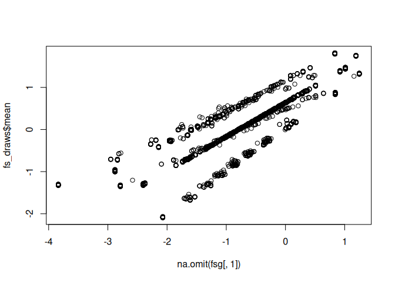
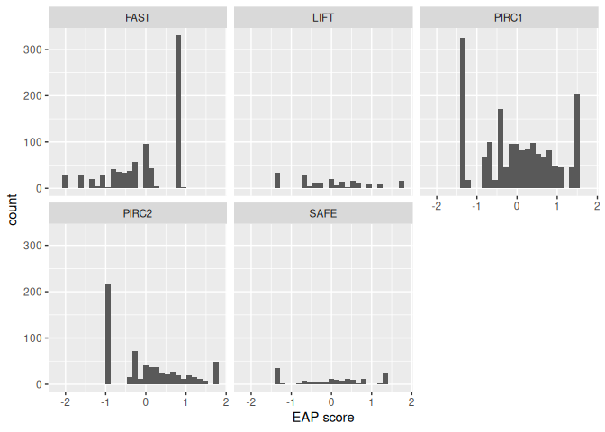

# Bayesian MNLFA


- [Load Packages](#load-packages)
- [Import Data](#import-data)
  - [Convert to long-format data](#convert-to-long-format-data)
- [Bayesian MNLFA](#bayesian-mnlfa)
  - [Extract harmonized scores](#extract-harmonized-scores)
- [Descriptives](#descriptives)
  - [Reliability](#reliability)

## Load Packages

``` r
library(tidyr)
library(ggplot2)
library(cmdstanr)
```

    This is cmdstanr version 0.8.1

    - CmdStanR documentation and vignettes: mc-stan.org/cmdstanr

    - CmdStan path: /home/markl/.cmdstan/cmdstan-2.35.0

    - CmdStan version: 2.35.0

## Import Data

Data can be downloaded from <https://github.com/jmk7cj/SEM-mnlfa>.

``` r
data <- read.csv(here::here("SEM-mnlfa", "data.csv"))
# Define grouping variable
data$group <- data$study_id
# Sort data by group
data <- data[order(data$group), ]
head(data)
```

         id study_id    sex  race T_TOCA_breakrule T_TOCA_harmpro T_TOCA_breakthg
    1 FT001     FAST   male black                0             NA               0
    2 FT002     FAST   male white                1             NA               0
    3 FT003     FAST female white                0             NA               0
    4 FT004     FAST female white                1             NA               0
    5 FT005     FAST   male black                1             NA               0
    6 FT006     FAST   male black                1             NA               1
      T_TOCA_takeprop T_TOCA_fight T_TOCA_lies T_TOCA_yell T_TOCA_stub T_TOCA_teas
    1               0            0           0           0           0           0
    2               1            1           0           1           1           1
    3               0            0           0           1           0           0
    4               0            1           1           0           1           0
    5               0            1           0           1           1           1
    6               1            1           1           1           1           1
      hs group
    1  1  FAST
    2  1  FAST
    3  1  FAST
    4  0  FAST
    5  1  FAST
    6  1  FAST

``` r
# Sample sizes
# Study 1 = FAST; Study 2 = LIFT; Study 3 = PIRC1;
# Study 4 = PIRC2; Study 5 = SAFE
table(data$study_id)
```


     FAST  LIFT PIRC1 PIRC2  SAFE 
      817   451  1884   639   157 

``` r
item_names <- names(data)[5:13]  # save item names
```

### Convert to long-format data

This is needed for handling missing data. See
<https://mc-stan.org/docs/stan-users-guide/regression.html#item-response-models.section>.

``` r
data_long <- data[c("id", "study_id", "sex", "race", item_names)] |>
    tidyr::pivot_longer(cols = -(id:race), names_to = "item", values_to = "y")
# Exclude missing observations
data_long_lw <- data_long[complete.cases(data_long[, "y"]), ]
```

## Bayesian MNLFA

The model is coded in the Stan language (see
<https://mc-stan.org/docs/stan-users-guide/>). It uses regularization
(hierarchical shrinkage prior; see
<https://projecteuclid.org/journals/electronic-journal-of-statistics/volume-11/issue-2/Sparsity-information-and-regularization-in-the-horseshoe-and-other-shrinkage/10.1214/17-EJS1337SI.full>)
to allow covariates to moderate loadings, intercepts, latent means, and
the logarithm of latent SDs.

``` stan
//
// From https://mc-stan.org/docs/stan-users-guide/regression.html#item-response-models.section
//

// The input data is an array of integers.
data {
  int<lower=1> J;                     // number of students
  int<lower=1> K;                     // number of questions
  int<lower=1> N;                     // number of observations
  array[N] int<lower=1, upper=J> jj;  // student for observation n
  array[N] int<lower=1, upper=K> kk;  // question for observation n
  array[N] int<lower=0, upper=1> y;   // correctness for observation n
  int<lower=1> p;                     // number of covariates
  matrix[N, p] X;                     // covariate predicting latent variance
}
parameters {
  vector[J] alpha_star;      // ability of student j - mean ability
  vector[K] gamma0_star;     // discrimination of question k (before rotation)
  vector[K] beta0;           // difficulty of question k
  vector[p] g_star;          // effect of x on latent mean
  vector[p] h;               // effect of x on log(latent SD)
  // Horseshoe prior for paths on intercepts
  matrix[p, K] zb;           // unregularized effect of x on intercepts
  real<lower=0> taub;        // global shrinkage
  matrix<lower=0>[p, K] lb;  // local shrinkage
  // Horseshoe prior for paths on loadings
  matrix[p, K] zc_star;      // unregularized effect of x on loadings/discrimination
  real<lower=0> tauc;        // global shrinkage
  matrix<lower=0>[p, K] lc;  // local shrinkage
}
transformed parameters {
  matrix[p, K] b = zb .* lb * taub;
  matrix[p, K] c_star = zc_star .* lc * tauc;
}
// The model to be estimated. 
model {
//   alpha_star ~ std_normal();         // informative true prior
  h ~ std_normal();
  g_star ~ std_normal();
  alpha_star ~ std_normal();
  beta0 ~ normal(0, 2.5);          // informative true prior
  gamma0_star ~ normal(1, 2.5);      // informative true prior
  to_vector(zb) ~ std_normal();
  to_vector(lb) ~ student_t(3, 0, 1);
  taub ~ std_normal();
  to_vector(zc_star) ~ std_normal();
  to_vector(lc) ~ student_t(3, 0, 1);
  tauc ~ std_normal();
  {
    vector[N] dbeta;  // deviation from reference intercepts
    vector[N] dgamma;  // deviation from reference intercepts
    for (n in 1:N) {
      dbeta[n] = X[n, ] * b[, kk[n]];  // choose the right item for observation n;
      dgamma[n] = X[n, ] * c_star[, kk[n]];
    }
    y ~ bernoulli_logit((gamma0_star[kk] + dgamma) .*
                            (exp(X * h) .* (alpha_star[jj] + X * g_star)) +
                            beta0[kk] + dbeta);
  }
}
generated quantities {
    vector[K] gamma0;
    vector[J] alpha;
    vector[p] g;
    matrix[p, K] c;
    {
        int sign_l1 = gamma0_star[1] > 0 ? 1 : -1;
        gamma0 = sign_l1 * gamma0_star;
        alpha = sign_l1 * alpha_star;
        g = sign_l1 * g_star;
        c = sign_l1 * c_star;
    }
}
```

``` r
# Compile the model
mnlfa_mod <- cmdstan_model("twopl_rev_mnlfa.stan")
```

``` r
# Prepare data
stan_data <- list(
    J = length(unique(data_long_lw$id)),
    K = length(unique(data_long_lw$item)),
    N = nrow(data_long_lw),
    jj = as.numeric(factor(data_long_lw$id, levels = unique(data_long_lw$id))),
    kk = as.numeric(factor(data_long_lw$item)),
    y = data_long_lw$y,
    p = 4,
    # Predictors: LIFT, PIRC1, PIRC2, SAFE
    X = model.matrix(~ factor(study_id),
                     data = data_long_lw)[, -1]
)
```

``` r
# Sampling (this takes a long time)
mnlfa_fit <- mnlfa_mod$sample(
    data = stan_data,
    chains = 4,
    parallel_chains = 4,
    adapt_delta = 0.99,
    max_treedepth = 12,
    iter_warmup = 1000,
    iter_sampling = 1000
)
mnlfa_fit$save_object("mnlfa_fit.RDS")
```

### Extract harmonized scores

Using posterior means and SDs

``` r
mnlfa_fit <- readRDS("mnlfa_fit.RDS")
# Extract factor scores
fs_draws <- mnlfa_fit$summary("alpha")[c("mean", "sd")]
```

Compare to aligned factor scores

``` r
fsg <- readRDS("fsg.RDS")
plot(na.omit(fsg[, 1]), fs_draws$mean)
```



``` r
cor(na.omit(fsg[, 1]), fs_draws$mean)
```

    [1] 0.8949201

## Descriptives

Add back Study ID

``` r
fs_draws$study_id <- data$study_id[data$id %in% unique(data_long_lw$id)]
ggplot(fs_draws, aes(x = mean)) +
    geom_histogram() +
    facet_wrap(~ study_id) +
    labs(x = "EAP score")
```

    `stat_bin()` using `bins = 30`. Pick better value with `binwidth`.



### Reliability

``` r
# Average reliability
rel_avg <- var(fs_draws$mean) /
    (var(fs_draws$mean) + mean(fs_draws$sd^2))
rel_avg
```

    [1] 0.7978924

``` r
# Group-specific reliability
relg <- tapply(fs_draws, INDEX = fs_draws$study_id,
    FUN = \(x) var(x$mean) /
        (var(x$mean) + mean(x$sd^2)))
relg
```

         FAST      LIFT     PIRC1     PIRC2      SAFE 
    0.7462122 0.8306291 0.8155098 0.7948264 0.8357258 
